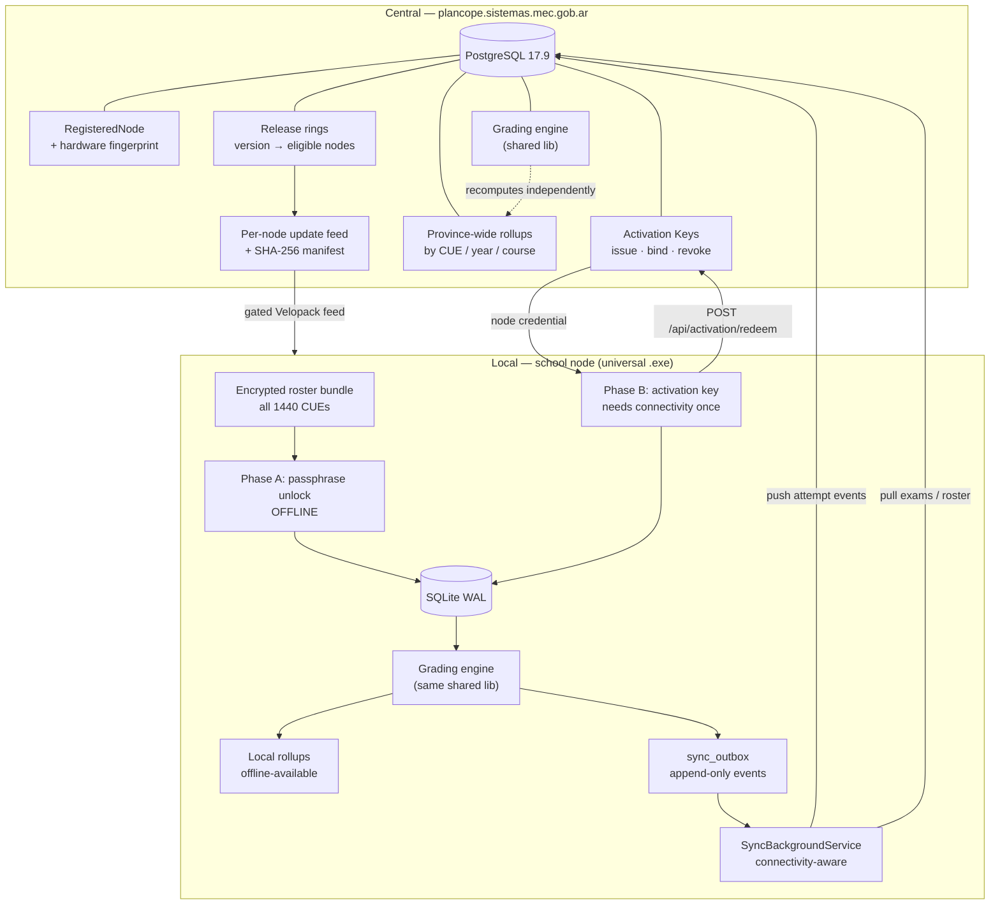
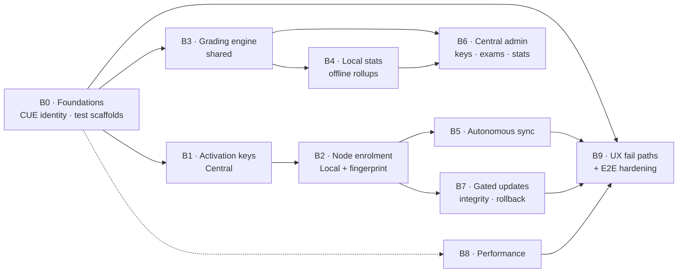

# Plan Cope — Project Closure Plan

**Status:** design locked, implementation pending
**Date:** 2026-09-15
**Owner:** Opus (architecture + coordination), Sonnet (batch leads), DeepSeek V4 Flash (implementers)

This document is the single source of truth for closing Plan Cope. It is written
so that each batch can be executed without re-analysing the architecture. Every
"as-is" claim below was verified against the code at the commit this plan was
written on, and carries a `path:line` reference.

---

## Table of contents

1. [Verified starting point](#1-verified-starting-point)
2. [Locked architectural decisions](#2-locked-architectural-decisions)
3. [Target architecture](#3-target-architecture)
4. [Batch map and dependency graph](#4-batch-map-and-dependency-graph)
5. [Batches](#5-batches)
6. [Execution model](#6-execution-model-opus--sonnet--deepseek)
7. [Cross-cutting acceptance gates](#7-cross-cutting-acceptance-gates)

---

## 1. Verified starting point

This section exists so no batch re-derives it. **Do not assume something is
missing because it is not listed in the README** — the audit below supersedes it.

### 1.1 What already exists and works

| Capability | Where | State |
|---|---|---|
| Cursor-based exam pull (Central → Local) | `src/Central/PlanCope.Central.Api/Controllers/SyncController.cs:18-64`, `src/Local/PlanCope.Local.Api/Services/LocalExamPullService.cs:21-74` | Working. Cursor = `PublishedAt.UtcTicks`, page limit clamped 1–200, checksum verified per package. |
| Outbox push (Local → Central) | `src/Local/PlanCope.Local.Api/Services/LocalOutboxPushService.cs`, `SyncController.cs:66-113` | Working end-to-end for `AttemptSubmitted`. |
| Idempotency + duplicate/conflict policy | `src/Central/PlanCope.Central.Api/Sync/SyncPushPolicy.cs` | Working. `accept` / `duplicate` / `failed` by idempotency-key + payload checksum. |
| Exponential backoff on push failure | `LocalOutboxPushService.cs:151-161` | Working. `delay = min(3600, 2^min(retryCount,10))` seconds. |
| PII scrub on sync payloads | `SyncController.cs:250-281` + client-side mirror | Working. Rejects `document`, `documentHash`, `token`, `tokenHash`, `resolutionToken`, any property containing `dni`. |
| Roster envelope encryption | `tools/PlanCope.RosterCrypto/` | Working. AES-256-GCM per CUE, DEKs wrapped by Argon2id master key (64 MiB / 3 / 1). |
| Per-CUE offline roster decrypt | `src/Local/PlanCope.Local.Api/Services/EmbeddedRosterSeeder.cs:30-58` | Working, but hard-limited to one CUE by config (see 1.2). |
| DNI matching by HMAC | `DocumentHmacService.cs:25-35`, `LocalRosterRepository.cs:171-185` | Working. No plaintext DNI stored; lookup by `document_hash`. |
| Velopack update mechanism | `src/Local/PlanCope.Local.Host/Services/UpdateService.cs` | Built and unit-tested, **not wired** (see 1.2). |
| SQLite tuning | `LocalSqliteConnectionFactory.cs:13-19` | WAL, `foreign_keys=ON`, `busy_timeout=5000`, `synchronous=NORMAL`, `cache_size=-4000`. |
| Session progress aggregation | `SessionRepository.GetProgressAsync` | Working, single session scope only. |

### 1.2 Verified gaps — the real work

Ordered by structural impact, not by size.

**G1 — There is no grading. Anywhere.**
`AnswerKey.ScoreValue` is persisted and serialised but never compared against a
submitted answer. `ReceivedSubmissionAnswer` (`src/Shared/PlanCope.Shared.Domain/Central/SyncModels.cs:30`)
stores raw submitted JSON and nothing reads it. Searched `Score|IsCorrect|GradeAttempt|CalculateScore|ComputeScore`
across all C# projects: zero grading logic. **Statistics have nothing to measure
until this exists.** This was not on the original pending list and is the largest
single batch in this plan.

**G2 — Node credentials are unprovisionable.**
`central_access_token`, `central_url` and `node_id` are read from the local
`sync_state` table by three services (`LocalExamPullService`, `LocalRosterPullService`,
`LocalOutboxPushService`) and **written by nothing**. No endpoint, no UI, no seed.
Sync only works if a row is inserted into SQLite by hand. There is also no expiry
handling: a stale token yields a 401 that surfaces as a generic failure, with no
refresh path.

**G3 — `RegisteredNode` is modelled and orphaned.**
`sync.registered_nodes` exists with a unique `NodeCode` and has no controller,
no service, no consumer. It is the natural anchor for activation keys.

**G4 — Activation is cosmetic.**
`ActivationScreen.tsx:8` validates only that the passphrase is non-empty.
`MainForm.cs:158-168` stores the **raw passphrase bytes** via DPAPI.
`ActivationKeyStore.Load()` has zero production callers (`ActivationKeyStore.cs:38-49`) —
it is exercised only by tests. The passphrase that actually decrypts the roster is
a *different* secret, `RosterBundle:Passphrase`, injected at build time. The two
are unconnected today.

**G5 — No hardware identity exists.**
Searched `machineid|hardware.?id|hwid|fingerprint|device.?id|MachineGuid` across
`.cs`/`.ts`/`.tsx`: zero hits repo-wide.

**G6 — CUE is never a foreign key.**
It is a loose `TEXT` scalar in `local_roster_snapshots.cue` and
`delivery_sessions.school_code`. On Central, `core.schools.Cue` is indexed but
**not unique**. Aggregating by establishment on top of this is unsound.

**G7 — No automatic sync.**
Deliberate, and documented in code (`SyncEndpoints.cs:68-69`: *"Outbox transport is
deliberately manual as well. A release/operator invokes this endpoint; no background
retry loop is registered."*). No `IHostedService` is registered anywhere on the
Local side. No connectivity detection exists in either the .NET host or the ClientApp
(no `navigator.onLine`, no retry queue).

**G8 — Update path is unwired and ungated.**
`UpdateService` / `VelopackUpdateBackend` / `UpdateStatus.tsx` have zero production
callers. `VelopackUpdateBackend._updateUrl` is a constructor parameter that nothing
supplies. `GitHubReleaseInstallerStorage.cs:52-53` documents that the GitHub Releases
API exposes no SHA-256 for assets, so the integrity field is returned empty. There is
no per-device gating axis — `channel` (`stable`/`beta`) is the only one, and there is
no device concept to gate on.

**G9 — Two test projects are empty shells.**
`tests/PlanCope.SyncCompat.Tests` and `tests/PlanCope.E2E.Tests` each contain only a
`.csproj` and an empty `AssemblyMarker.cs`, with no test framework package referenced.
`E2E.Tests` is still invoked by `ci-local-app.yml` as a silent no-op.

**G10 — No performance work on the Local node.**
No AOT, trimming, ReadyToRun, `RuntimeIdentifier`, publish profiles, or caching
abstractions. `Polly.Extensions.Http` 3.0.0 is pinned in `Directory.Packages.props`
but referenced by **no** `.csproj`. The ClientApp ships `@dnd-kit/*`,
`react-hook-form`, `zod` and `@base-ui/react` with zero imports. Two components
(`WorkspaceModeTabs.tsx`, `UpdateStatus.tsx`) are orphaned. No list virtualisation
anywhere. `useDeliverySession.ts:255-263` runs a 3-second `setInterval` for the
entire duration of an active session.

**G11 — DNI fail path is correct but harsh.**
`AttemptEndpoints.cs:60-63` returns `404 {"error": "No encontramos ese DNI en la
sección seleccionada."}` and the UI renders it in a red `role="alert"` banner
(`SessionEntryPanel.tsx:52`). No name is ever leaked on a miss — the security
property is already right. Only the tone is wrong.

**G12 — Builder cannot author two supported block types.**
`BlockType` (`Enums.cs:3-10`) is `Text, Image, MultipleChoice, TrueFalse, ShortAnswer`.
The Central Web builder maps only to `MultipleChoice`, `TrueFalse`, `ShortAnswer`
(`app/_lib/schema/mappers.ts`). `Text` and `Image` blocks can be pulled and rendered
but never created.

### 1.3 Resolved contradiction

`docs/plan-cicd-batches.md` decision 1 states a **single universal `.exe`** with the
CUE typed at runtime, to avoid 1,440 builds. The implementation diverged:
`RosterBundleOptions.Cue` is a single build-time string and
`scripts/Build-SchoolRelease.ps1:94` emits one release directory per CUE
(`artifacts/local-release/$normalizedCue-$SchoolYear`).

**Resolution (owner decision, 2026-09-15): the documented decision wins.** One
universal `.exe`. One activation key unlocks every school, not a single CUE.

This is cheaper than it looks. `RosterBundleFormat.DeriveMasterKey(passphrase, salt, params)`
derives the master key from the **passphrase alone** — the CUE is never key material,
only an AAD component and a lookup index. One passphrase already unlocks all 1,440
entries cryptographically. The single-CUE limit is purely the
`RosterBundleOptions.Cue` config string. No crypto changes are required.

**Accepted risk, stated explicitly:** with a universal bundle and a universal
passphrase, one leaked installer plus one leaked passphrase exposes all 227,598
students. Under build-per-CUE the blast radius was one school. This plan mitigates
by *separating unlock from enablement* (see 2.2), not by reducing the unlock scope.

---

## 2. Locked architectural decisions

These bind every batch. A batch that needs to contradict one must escalate to Opus,
not work around it.

### 2.1 The sixteen inherited decisions stand

`docs/plan-cicd-batches.md` records 16 numbered decisions. All remain binding except
decision 4, which is **extended** (not reversed) by 2.2 below. Decision 1 is
**reaffirmed** and the implementation is corrected to match it (see 1.3).

Of particular relevance to this plan:
- **D5** — the CUE is never the decryption key. Unchanged; the design in 1.3 relies on it.
- **D6** — nothing installer-shaped becomes a public Release asset. Unchanged, and
  Batch 7 must not violate it when building the gated update feed.
- **D11** — persistent data lives in `%LocalAppData%\PlanCope\`; Velopack updates
  must never touch it. Batch 7 verifies this explicitly.
- **D13** — roster access scope via the `roster_scope` claim (`province`|`school`),
  deny-by-default when the claim is absent. Batch 6 extends this to the new admin
  surfaces rather than inventing a second authorization model.

### 2.2 Two-phase activation (new — extends D4)

Unlock and enablement are **separate mechanisms with separate failure modes**. This
is the core of the design.

**Phase A — offline unlock.** The operator types the roster passphrase. Argon2id
derives the master key, the bundle becomes readable for *all* CUEs, and the operator
selects the CUE for this machine. Requires **no connectivity**. A school can run an
exam session on the day of install with no internet, ever.

**Phase B — online enrolment.** The operator types an *activation key* issued by
Central. The node posts the key plus its hardware fingerprint; Central registers a
`RegisteredNode`, binds it to the fingerprint and CUE, and returns a node credential.
That credential is what closes G2. Requires connectivity **once**, and can happen
days after Phase A.

Consequences that make this worth the extra moving part:
- Offline-first is preserved absolutely. Phase B never blocks exam delivery.
- Activation keys become **revocable** without touching the crypto. Revoking a key
  stops sync and updates for that node; it does not, and cannot, un-decrypt a bundle
  already on disk. This is stated honestly rather than sold as containment.
- The blast radius of a leaked *passphrase* (all rosters, unrevocable) and a leaked
  *activation key* (one node's server access, revocable) are different sizes and are
  managed differently.

### 2.3 CUE is promoted to a first-class key

CUE becomes a real entity on both sides, with referential integrity, not a loose
string. `core.schools.Cue` becomes **unique** on Central; a `schools` table keyed by
CUE appears on Local, and roster snapshots and delivery sessions take a real foreign
key to it. Every statistic in this plan aggregates through that key.

### 2.4 Grading is shared, deterministic and versioned

One grading implementation, in a new `PlanCope.Shared.Grading` project, referenced by
**both** Central and Local. Two implementations would drift, and a divergence between
the score a school sees offline and the score the province sees centrally is a
credibility failure, not a bug.

Every grading run stamps a `grading_schema_version`. Results are reproducible: the
same answers plus the same answer key plus the same version always produce the same
score. Re-grades are additive and traceable, never destructive.

### 2.5 Statistics are derived, never synced

Local computes its own rollups for offline display. Central recomputes independently
from the attempt events that already flow through the outbox.

**Nothing bidirectionally mutable is ever synced.** This is deliberate: it means
there is no statistics merge, no last-write-wins, and no conflict resolution to get
wrong. The only thing that crosses the wire is the append-only attempt event stream
that already works today. Conflicts are structurally impossible rather than handled.

### 2.6 Updates are gated server-side, verified client-side

Central decides which version a specific node may install, keyed by hardware
fingerprint. The node verifies integrity itself before applying. Neither side trusts
the other alone.

### 2.7 Scoring policy belongs to the exam, and is never implicit

The rule used to score a partially-correct multi-select answer is **chosen by the
author when the exam is created**, not hard-coded in the engine. Available policies:

| Policy | Rule |
|---|---|
| `AllOrNothing` | Only an exact match scores. |
| `ProportionalPenalised` | `(correct selected − incorrect selected) / total correct`, floored at 0. |
| `ProportionalPlain` | `correct selected / total correct`. Selecting everything scores full marks — offered only because some authors want it; the builder warns. |

Two consequences that must be respected:

- **The policy travels inside the exam document**, so it enters the package checksum
  computed at `ExamsController.cs:351-365` and becomes immutable on publish, exactly
  like the questions. An exam cannot change scoring rules after students have sat it.
- **There is no implicit default.** An exam version with no policy is **ungradable** and
  the engine refuses it rather than guessing. Refusing is safe; guessing silently
  produces wrong marks for real students.

Exam versions published *before* this feature exists cannot carry the field, and
published versions are immutable by design (`IsPublished` gate, `ExamsController.cs:198-201`).
Rather than break immutability, a separate `exam_grading_policies` record assigns a
policy to a legacy version — set once, by an administrator, audited. The engine resolves
in order: document policy → assignment record → **refuse to grade**.

### 2.8 Revocation is enforced on reconnect, and drains before it locks

A revoked activation key removes that machine's access the next time it reaches Central.

The honest limit, stated once so nobody designs against a promise that cannot be kept:
**offline capability and remote revocation are in direct tension.** A revoked machine
that never connects keeps working. This is accepted — an offline node exfiltrates
nothing new, and the roster on its disk was already decrypted by the passphrase on day
one. **Revocation cannot un-decrypt what is already on disk. Nothing can.**

Enforcement order is fixed and must not be reordered for convenience:

1. **Never during an active session.** A classroom mid-exam is never interrupted.
   Enforcement waits for the session to close.
2. **Drain first.** Every pending outbox row is pushed before anything is destroyed.
   Collected student data belongs to the province; losing it is worse than the
   compromise that triggered the revocation.
3. **Then wipe.** The decrypted roster cache and the node credential are destroyed.
4. **Then lock.** The app requires a fresh activation to return.

---

## 3. Target architecture



### 3.1 Data model additions

**Central (PostgreSQL):**

```sql
-- sync.activation_keys
id uuid PK
key_hash text NOT NULL UNIQUE          -- Argon2id hash; plaintext never stored
key_prefix text NOT NULL               -- first 8 chars, for admin lookup/display
issued_by uuid NOT NULL REFERENCES core.users(id)
issued_at timestamptz NOT NULL
expires_at timestamptz NULL
max_activations int NOT NULL DEFAULT 1
activation_count int NOT NULL DEFAULT 0
revoked_at timestamptz NULL
revoked_reason text NULL
scope_cue text NULL                    -- ALWAYS NULL by decision: keys are universal
note text NULL

-- sync.registered_nodes  (EXISTS, extended)
+ fingerprint_hash text NOT NULL
+ fingerprint_components jsonb NOT NULL -- which signals matched, for drift diagnosis
+ cue text NOT NULL REFERENCES core.schools(cue)
+ activation_key_id uuid REFERENCES sync.activation_keys(id)
+ enrolled_at timestamptz NOT NULL
+ last_seen_at timestamptz NULL
+ revoked_at timestamptz NULL
+ app_version text NULL

-- sync.node_credentials
id uuid PK
node_id uuid NOT NULL REFERENCES sync.registered_nodes(id)
refresh_token_hash text NOT NULL UNIQUE
issued_at timestamptz NOT NULL
expires_at timestamptz NOT NULL
rotated_from uuid NULL REFERENCES sync.node_credentials(id)
revoked_at timestamptz NULL

-- release.rings
id uuid PK
version text NOT NULL
channel text NOT NULL                  -- stable | beta
sha256 text NOT NULL                   -- computed at release time; GitHub API does not expose it
min_version text NULL                  -- refuse to jump from older than this
rollout_mode text NOT NULL             -- all | cue_list | node_list | percentage
rollout_spec jsonb NOT NULL
enabled boolean NOT NULL DEFAULT false
created_at timestamptz NOT NULL

-- stats.exam_rollups
cue text NOT NULL REFERENCES core.schools(cue)
school_year text NOT NULL
course text NOT NULL
exam_version_id uuid NOT NULL
grading_schema_version int NOT NULL
attempts_total int NOT NULL
attempts_graded int NOT NULL
score_sum numeric NOT NULL
score_min numeric NOT NULL
score_max numeric NOT NULL
per_block_stats jsonb NOT NULL         -- correct/incorrect/blank per block
computed_at timestamptz NOT NULL
PRIMARY KEY (cue, school_year, course, exam_version_id, grading_schema_version)

-- exam.grading_policies  — legacy assignment only; new exams carry it in the document
exam_version_id uuid PK REFERENCES exam.versions(id)
policy text NOT NULL                   -- AllOrNothing | ProportionalPenalised | ProportionalPlain
assigned_by uuid NOT NULL REFERENCES core.users(id)
assigned_at timestamptz NOT NULL
```

Also: `core.schools.Cue` gains a **unique** index (currently non-unique — see G6).

**Key scope (owner decision):** activation keys are **universal** — `scope_cue` stays
NULL and any key can enrol a node at any school. This removes per-key traceability, so
the compensating controls in B1 are not optional extras; they are what replaces it.

**Local (SQLite):**

```sql
-- 008_Schools.sql
CREATE TABLE schools (
  cue TEXT PRIMARY KEY NOT NULL,       -- 9 digits, normalized via CueCode
  name TEXT NULL,
  unlocked_at TEXT NOT NULL
);
-- backfill from local_roster_snapshots.cue, then add FKs

-- 009_NodeIdentity.sql
CREATE TABLE node_identity (
  id TEXT PRIMARY KEY,
  node_id TEXT NULL,                   -- NULL until Phase B completes
  cue TEXT NOT NULL REFERENCES schools(cue),
  fingerprint_hash TEXT NOT NULL,
  enrolled_at TEXT NULL,
  last_sync_at TEXT NULL,
  credential_state TEXT NOT NULL       -- unenrolled | active | revoked | expired
  revocation_detected_at TEXT NULL,
  revocation_stage TEXT NULL           -- detected | drained | wiped | locked
);

-- 010_Grading.sql
CREATE TABLE attempt_results (
  id TEXT PRIMARY KEY,
  student_attempt_id TEXT NOT NULL REFERENCES student_attempts(id) ON DELETE CASCADE,
  grading_schema_version INTEGER NOT NULL,
  score_raw REAL NOT NULL,
  score_max REAL NOT NULL,
  graded_at TEXT NOT NULL,
  UNIQUE (student_attempt_id, grading_schema_version)
);
CREATE TABLE block_results (
  id TEXT PRIMARY KEY,
  attempt_result_id TEXT NOT NULL REFERENCES attempt_results(id) ON DELETE CASCADE,
  block_id TEXT NOT NULL,
  outcome TEXT NOT NULL,               -- correct | incorrect | partial | blank | ungradable
  score_awarded REAL NOT NULL,
  score_possible REAL NOT NULL
);
CREATE INDEX ix_block_results_attempt ON block_results (attempt_result_id);

-- 011_Stats.sql
CREATE TABLE stats_rollups (
  cue TEXT NOT NULL REFERENCES schools(cue),
  school_year TEXT NOT NULL,
  course TEXT NOT NULL,
  exam_version_id TEXT NOT NULL,
  grading_schema_version INTEGER NOT NULL,
  attempts_total INTEGER NOT NULL,
  attempts_graded INTEGER NOT NULL,
  score_sum REAL NOT NULL,
  score_min REAL NOT NULL,
  score_max REAL NOT NULL,
  per_block_stats TEXT NOT NULL,       -- JSON
  computed_at TEXT NOT NULL,
  PRIMARY KEY (cue, school_year, course, exam_version_id, grading_schema_version)
);
```

### 3.2 Activation key format

`PCOPE-XXXXX-XXXXX-XXXXX-CC` — Crockford base32 (no `I`/`L`/`O`/`U`, case-insensitive),
15 payload characters, 2-character checksum. Rationale: typed by a field operator on
a school machine, so it must survive transcription errors and be verifiable offline
*as a format* before any network call is attempted. The checksum catches typos
locally; only a well-formed key is worth a round trip.

Central stores `Argon2id(key)` and an 8-character prefix for admin lookup. **The
plaintext key is displayed exactly once, at issue time, and is never recoverable.**

---

## 4. Batch map and dependency graph



**Critical path:** B0 → B1 → B2 → B5 → B9.

**Safe parallelisation:**
- After B0: **B1 and B3 run concurrently** (different projects, no shared files).
- After B3: **B4 and B6's stats surface** run concurrently.
- **B8 runs concurrently with everything from B0 onward** — it touches build config,
  dead dependencies and rendering, none of which the other batches modify. It must
  merge *before* B9 so the E2E suite measures the optimised build.
- **B7 depends only on B2**, not on B3/B4/B5. It can run in parallel with the entire
  grading and stats track.

**Never parallelise:** B1 with B2 (B2 consumes B1's contracts), B3 with B4 (B4 reads
B3's result tables), B5 with B2 (B5 needs the credential B2 provisions).

---

## 5. Batches

### B0 · Foundations: CUE identity and honest test scaffolds

**Objective.** Make CUE a real key on both sides and turn the two empty test projects
into functioning suites, so every later batch has referential integrity and a place
to put contract tests.

**Dependencies.** None. This is the root.

**Main tasks.**
1. Central migration: make `core.schools.Cue` unique. Detect and resolve duplicates
   first — this may fail against production data and that outcome must be reported,
   not worked around.
2. Local migrations `008_Schools.sql`: create `schools`, backfill from
   `local_roster_snapshots.cue` and `delivery_sessions.school_code`, then add FKs from
   `local_roster_snapshots.cue` and `delivery_sessions.school_code`.
3. Introduce `CueCode` at every boundary that currently takes a bare string. Normalise
   on write, never on read.
4. Fill `tests/PlanCope.SyncCompat.Tests`: add xunit, then write real contract tests
   pinning the wire shape of every DTO in `PlanCope.Shared.Contracts` (round-trip,
   additive-change tolerance, required-field presence).
5. Fill `tests/PlanCope.E2E.Tests`: add xunit and a first real scenario (publish on
   Central → pull on Local → run session → push outbox → assert on Central).
6. Remove the silent no-op: `ci-local-app.yml:46` uses `npm run test --if-present`;
   make the JS test step explicit and failing-if-absent.

**Parallelisation.** Tasks 1–3 are one unit (schema). Tasks 4–6 are a second,
independent unit. Two implementers.

**Acceptance criteria.**
- `core.schools.Cue` is unique; migration is reversible; duplicate-CUE report produced.
- Every local table referencing a school does so by FK. `PRAGMA foreign_key_check`
  returns empty on a migrated production-shaped database.
- `SyncCompat.Tests` has ≥15 tests and fails if any contract field is renamed or removed.
- `E2E.Tests` has ≥1 green end-to-end scenario and is no longer a no-op in CI.
- `dotnet build PlanCope.slnx -warnaserror` stays green.

**Tests and QA.** Migration applied against a restored production snapshot, not a
fresh database. Rollback rehearsed. E2E scenario runs on `windows-latest` in CI.

**Risks.**
- *Duplicate CUEs in production* — likely, given the index is currently non-unique.
  If found, **stop and escalate to Opus**; do not silently deduplicate school records.
- *Backfill ambiguity* — `delivery_sessions.school_code` rows whose CUE has no roster
  snapshot. Decide explicitly: create a stub `schools` row, or fail the migration.
  Default: create the stub, log it, report the count.

---

### B1 · Activation keys (Central)

**Objective.** Issue, validate, bind and revoke activation keys. Wire the orphaned
`RegisteredNode` into a real lifecycle.

**Dependencies.** B0 (needs unique `schools.Cue` for the FK).

**Main tasks.**
1. Migrations for `sync.activation_keys`, `sync.node_credentials`, and the
   `sync.registered_nodes` extensions in 3.1.
2. `ActivationKeyService`: generate (Crockford base32 + checksum), hash with Argon2id,
   store prefix, enforce `max_activations`, `expires_at`, `revoked_at`.
3. `POST /api/activation/redeem` — **anonymous** endpoint (the node has no credential
   yet, by definition). Body: `{ activationKey, fingerprint, fingerprintComponents, cue, appVersion }`.
   Returns a node credential pair or a typed failure.
4. `POST /api/activation/refresh` — rotates the node credential; old refresh token is
   invalidated on use (`rotated_from` chain preserved for audit).
5. Admin endpoints: issue, list, revoke; scoped by the existing `roster_scope` claim
   per D13. Province scope issues for any CUE; school scope only for its own.
6. Rate limiting and lockout on `/api/activation/redeem` — this endpoint is anonymous
   and guessable by construction.
7. **Compensating controls for universal keys.** Because `scope_cue` is always NULL
   (3.1), a leaked key can enrol a node at any school and per-key traceability is gone.
   What replaces it:
   - `max_activations` is the primary lever. Keys are issued with a tight count, not
     an open-ended one.
   - Anomaly detection: alert when one CUE enrols an unusual number of nodes in a
     window, or when one key enrols across implausibly many CUEs.
   - Revocation is available at **both** levels — revoke the key (stops future
     enrolments) and revoke the node (stops one machine). They are different actions
     with different blast radii and the admin UI must not conflate them.
8. Expose revocation state on every authenticated node call, so B5 can detect it
   without a dedicated polling endpoint. **KISS: no second channel.**

**Parallelisation.** Tasks 1–2 first (one implementer). Then 3–4, 5–6 and 7–8 in
parallel (three implementers).

**Acceptance criteria.**
- A key can be issued, redeemed exactly `max_activations` times, and refused on the next attempt.
- A revoked key is refused; an expired key is refused; a malformed checksum is refused
  **without a database hit**.
- Revoking a key stops future enrolments but does not revoke nodes already enrolled by
  it; revoking a node stops that machine only. Both paths are tested.
- Redeeming twice from the *same* fingerprint is idempotent — it returns the existing
  node, not a duplicate registration, and does not consume a second activation.
- Redeeming from a *different* fingerprint consumes an activation.
- Plaintext keys appear in exactly one place: the issue response. Confirmed absent from
  logs, from the database, and from any list endpoint.
- `/api/activation/redeem` is rate-limited per IP and per key prefix.

**Tests and QA.** Unit tests for key generation/checksum/hashing. Integration tests for
the full redeem lifecycle including every refusal path. An explicit test asserting no
plaintext key is logged at any log level.

**Risks.**
- *Anonymous endpoint abuse.* Mitigated by checksum pre-validation, rate limiting and
  lockout. Accepted: a valid key can still be redeemed by whoever holds it — that is
  what a bearer secret is.
- *Fingerprint collision across cloned school images.* Plausible in a managed fleet
  imaged from a single master. Batch B2 must include at least one signal that survives
  imaging (see B2 risks); B1 must handle the collision case by refusing and reporting,
  not by silently merging nodes.

---

### B2 · Node enrolment and hardware identity (Local)

**Objective.** Implement two-phase activation. Close G2, G4, G5.

**Dependencies.** B1 (consumes its contracts).

**Main tasks.**
1. `HardwareFingerprintService`: composite of stable Windows signals — machine GUID
   (`HKLM\SOFTWARE\Microsoft\Cryptography\MachineGuid`), system volume serial, and a
   CPU/board identifier. Hash the composite; also persist which components matched, so
   drift is diagnosable rather than mysterious.
2. **Phase A** — rewrite `ActivationScreen` to unlock the bundle: passphrase → Argon2id →
   master key validated by attempting one real DEK unwrap → operator picks the CUE →
   `schools` row created. Fully offline.
3. Remove the single-CUE restriction: `RosterBundleOptions.Cue` is no longer a build-time
   constant. `EmbeddedRosterSeeder` decrypts the CUE selected at runtime.
   **`scripts/Build-SchoolRelease.ps1` is retired** in favour of a single universal build.
4. **Phase B** — new enrolment screen: activation key entry, client-side checksum
   validation, `POST /api/activation/redeem`, credential stored via DPAPI, `node_identity`
   and `sync_state` (`central_url`, `node_id`, `central_access_token`) populated. **This
   is what closes G2.**
5. Credential refresh: detect 401 distinctly from other failures across all three sync
   services, attempt refresh once, mark `credential_state = revoked` and surface it to
   the operator on definitive failure.
6. Make `ActivationKeyStore.Load()` load-bearing — it is currently dead code
   (`ActivationKeyStore.cs:38-49`).
7. `RevocationEnforcer`: implements the fixed sequence in 2.8 — wait for session end,
   drain outbox, wipe roster cache and credential, lock. Each step advances
   `node_identity.revocation_stage` so an interrupted enforcement resumes where it
   stopped instead of restarting. **The enforcer only executes; detection is B5's job
   (DRY: one detection site, not one per service).**
8. Re-activation screen for a locked node: the operator can recover the machine with a
   fresh key, without reinstalling.

**DPAPI scope — resolved.** School machines use a shared generic Windows account
(owner answer, 2026-09-15), so the existing `DataProtectionScope.CurrentUser`
(`ActivationKeyStore.cs:9`) is correct. **No change required.**

**Parallelisation.** Task 1 is standalone (one implementer, start immediately).
Tasks 2–3 are one unit. Tasks 4–6 are a second unit but depend on 1. Two implementers
after task 1 lands.

**Acceptance criteria.**
- Phase A completes with the network cable unplugged, and a full exam session runs to
  submission afterwards. **This is the single most important assertion in the plan.**
- Phase B completes later, independently, and populates all three `sync_state` keys.
- A node that never completes Phase B still delivers exams indefinitely; it only
  accumulates outbox rows.
- The fingerprint is stable across reboot, across a Velopack update, and across a
  RAM change. It is permitted to change on motherboard or system-disk replacement.
- One universal `.exe` unlocks any of the 1,440 CUEs with the correct passphrase.
- Revocation enforcement follows 2.8 exactly: a revoked node mid-session finishes the
  session, then drains every pending outbox row, then wipes, then locks. A test asserts
  **zero data loss** across the whole sequence.
- Enforcement interrupted by a power cut resumes from its recorded stage; it never
  re-drains already-sent rows and never leaves the node half-wiped but unlocked.
- A locked node can be recovered with a fresh key without reinstalling.

**Tests and QA.** Fingerprint stability suite on Windows. Offline Phase A test with
network disabled. A test asserting that a node with `credential_state = revoked` still
serves `/api/sessions/*` normally. Manual QA on the Velopack matrix
(`docs/velopack-test-matrix.md`) for data-directory survival.

**Risks.**
- *Fleet imaging collisions* (see B1). If school machines are cloned from one image,
  `MachineGuid` may be identical across them. Include the volume serial, which is
  regenerated per install, and **verify this assumption against a real school machine
  before B7 depends on it.**
- *Fingerprint drift locking out a legitimate school.* Mitigation: Central allows
  re-enrolment with an admin-visible drift record rather than hard-refusing. A school
  must never be unable to work because a hard disk was replaced.
- *Accidental revocation bricking a working school.* The enforcement sequence is
  destructive and triggered remotely. Revocation in the admin UI must require explicit
  confirmation naming the school, and must be reversible **before** the node next
  connects. Once the node has wiped, only re-activation recovers it.

---

### B3 · Grading engine (shared)

**Objective.** Build the grading capability that does not exist. Closes G1.

**Dependencies.** B0.

**Main tasks.**
1. New project `src/Shared/PlanCope.Shared.Grading`, referenced by both
   `Central.Api` and `Local.Api`. No duplicate implementation, per 2.4.
2. `IBlockGrader` per gradable `BlockType`: `MultipleChoice`, `TrueFalse`, `ShortAnswer`
   (normalised exact match plus a configurable accepted-answers list). `Text` and
   `Image` are **explicitly ungradable** and must be classified as such, not scored zero.
3. `ScoringPolicy` enum plus one strategy per policy (2.7). The multi-select grader
   **delegates** to the strategy; it must not contain a branch per policy.
   **DRY: the three formulas live in exactly one place each.**
4. `GradingEngine.Grade(examVersion, answers) → AttemptResult` — pure, deterministic,
   no I/O, no clock, no randomness. Resolves policy as document → assignment record →
   **throw `UngradableExamException`**. It never guesses.
5. `GradingSchemaVersion` constant, stamped on every result.
6. Add `scoringPolicy` to the exam document schema and to `PublishedExamPackageDto`, so
   it enters the publish checksum (`ExamsController.cs:351-365`) and is carried by the
   existing sync pull with no new transport. **KISS: no separate policy sync.**
7. Local migration `010_Grading.sql`; grade on attempt submission inside the existing
   `SubmitWithOutboxAsync` transaction.
8. Central: recompute independently from `ReceivedSubmissionAnswer` rows on ingest.
9. Re-grade command: additive, writes a new `grading_schema_version` row, never
   overwrites a prior result.

**Parallelisation.** Tasks 1–6 are one unit and must land first. Tasks 7 and 8 then run
in parallel (two implementers, different sides).

**Acceptance criteria.**
- Identical inputs produce byte-identical results on Central and Local. Enforced by a
  shared golden-file fixture exercised by **both** test suites.
- `Text` and `Image` blocks are recorded as `ungradable` and excluded from both the
  numerator and the denominator of any score.
- A blank answer is `blank`, not `incorrect`. These are different pedagogical facts and
  the statistics must be able to tell them apart.
- Re-grading under a new schema version leaves the old results intact and queryable.
- Grading an attempt is idempotent.
- An exam version with no scoring policy is **refused**, on both sides, with the same
  typed error. No default is applied anywhere — verified by test.
- Each of the three policies is exercised against the worked examples in 2.7 and matches
  them exactly.

**Tests and QA.** Property-based tests: score is always within `[0, score_max]`; the sum
of block scores equals the attempt score. Golden files shared across both suites.
Performance: grading 500 attempts completes within budget on the low-end target (see B8).

**Risks.**
- *Legacy published exams are ungradable* until an administrator assigns a policy
  (B6 task 8). Produce the count early — if it is large, the assignment UI must support
  bulk selection rather than one exam at a time.
- *`ShortAnswer` normalisation* — accents, case, whitespace, synonyms. Over-normalising
  marks wrong answers correct. Start strict and configurable; do not add fuzzy matching
  in this batch.
- *Divergence risk* is the reason for the shared project. A reviewer must reject any PR
  that adds grading logic outside `PlanCope.Shared.Grading`.

---

### B4 · Local statistics and offline rollups

**Objective.** Statistics by course, year and establishment, available fully offline.

**Dependencies.** B3 (nothing to aggregate without it), B0 (needs the CUE key).

**Main tasks.**
1. Local migration `011_Stats.sql`.
2. `StatsRollupService`: incremental update on attempt grading — recompute only the
   affected `(cue, school_year, course, exam_version)` tuple, never a full table scan.
   This is a low-end-hardware constraint, not an optimisation.
3. Full-rebuild command for recovery and for post-re-grade reconciliation.
4. Local endpoints: `GET /api/stats/school`, `/api/stats/course`, `/api/stats/exam`,
   filterable by year and course.
5. Operator UI in the host console: per-course and per-exam breakdown, per-block
   difficulty, blank-vs-incorrect split.
6. CSV export for offline sharing — schools with no connectivity still need to hand
   results to a supervisor.

**Parallelisation.** Tasks 1–3 first. Then 4–5 and 6 in parallel.

**Acceptance criteria.**
- Every statistic is computed and displayed with the network cable unplugged.
- Rollups match a full recomputation exactly, verified by a reconciliation test.
- Aggregation by course, by year and by CUE each return correct figures on a seeded
  fixture of ≥1,000 attempts.
- A rollup query returns in under 200 ms on the low-end target profile.
- `blank` and `incorrect` are reported as distinct figures throughout.

**Tests and QA.** Reconciliation test: incremental rollups vs. full rebuild, after a
randomised sequence of submissions. Offline test with networking disabled. Performance
test at 1,000+ attempts.

**Risks.**
- *Rollup drift* if an incremental update is missed. Mitigation: the full-rebuild command
  plus a periodic self-check that compares a sampled tuple and reports mismatch.
- *Small-cohort privacy — resolved.* Minimum cohort is **5, applied only to provincial
  views** (owner decision, 2026-09-15). A school sees all of its own figures without
  suppression; it already knows its students, so there is nothing to protect. The
  threshold binds only when a province-scoped user looks down into a school. Implement
  it as **one suppression filter parameterised by the existing `roster_scope` claim
  (D13) — not two aggregation paths.** Suppressed cells report "cohorte insuficiente",
  never a blank that reads as zero.

---

### B5 · Autonomous synchronisation

**Objective.** Sync without an operator pressing anything. Closes G7.

**Dependencies.** B2 (needs a provisioned credential — this is the hard blocker).

**Main tasks.**
1. `SyncBackgroundService` (`IHostedService`) in `Local.Api`. It replaces manual
   invocation; the manual endpoints stay for diagnostics.
2. Connectivity detection: cheap probe against `/health/live` with jittered backoff.
   Never a tight loop — this runs on a school machine that is also delivering an exam.
3. Reference `Polly.Extensions.Http` from `Local.Api.csproj`. It is already pinned in
   `Directory.Packages.props` and referenced by **nothing** (G10). Apply a retry plus
   circuit-breaker policy to all three sync HTTP clients, which currently have **no
   configuration at all** (`LocalDataServiceCollectionExtensions.cs:34-36`).
4. Full-jitter exponential backoff, layered over the outbox's existing per-row backoff.
   Do not replace the row-level policy; they solve different problems.
5. **Never sync during an active exam session.** Delivery latency beats sync freshness.
   Queue and defer.
6. Fix the `sync_state` key mismatch: `LocalExamPullService` writes
   `last_exam_pull_cursor` while `/api/sync/status` reads `last_pull_at`, so the status
   endpoint's `lastPullAt` is permanently null.
7. Operator-visible sync state: last success, pending count, last error, next attempt.
   An offline school must be able to see *why* nothing has synced.
8. **Revocation detection.** Any authenticated response carrying revoked state (B1 task 8)
   marks `credential_state = revoked` and hands off to B2's `RevocationEnforcer`.
   **DRY: this is the only place revocation is detected.** The three sync services do
   not each implement their own check.

**Parallelisation.** Tasks 1–2 and 3–4 in parallel. Tasks 5–8 after both land.

**Acceptance criteria.**
- With connectivity restored after 24 h offline, all pending outbox rows drain without
  operator action.
- Zero duplicates on Central after a drain — verified against `SyncPushPolicy`'s
  `duplicate` classification, which must be exercised, not bypassed.
- A mid-push connection drop leaves the outbox consistent; the next cycle resumes
  correctly.
- No sync HTTP activity occurs while a session is `active`.
- Idle CPU attributable to sync is under 1% on the low-end target.
- `/api/sync/status` reports accurate timestamps.
- A node revoked while offline detects it on the first successful call after reconnect,
  and enforcement begins by draining — never by wiping.

**Tests and QA.** Chaos testing: kill connectivity mid-push, mid-pull, and between
batches. 24-hour-offline soak with accumulated outbox, then reconnect. Duplicate
assertion on Central. Session-priority test: start a session, assert sync is suspended.

**Risks.**
- *Sync degrading exam delivery on weak hardware* — the reason for task 5. This is the
  highest-consequence risk in the batch: a slow exam is a visible failure in a classroom.
- *Thundering herd.* Hundreds of schools reconnecting simultaneously after a regional
  outage. Full jitter is mandatory, not optional.
- *Clock skew.* The pull cursor is `PublishedAt.UtcTicks`, server-generated, so pull is
  safe. Push ordering uses local timestamps; do not introduce any server-side logic that
  trusts a node's clock.

---

### B6 · Central administration surfaces

**Objective.** Administer activation keys, exams and province-wide statistics from
`plancope.sistemas.mec.gob.ar`.

**Dependencies.** B1 (keys), B3 (grading), B4 (rollup shape, reused server-side).

**Main tasks.**
1. Central `stats.exam_rollups` plus a recompute service fed by ingested attempts.
2. `/api/stats/*` on Central, scoped by the `roster_scope` claim per D13 — province sees
   all CUEs, school scope sees only its own. Deny-by-default when the claim is absent.
3. Central Web: activation key management (issue, list, revoke, copy-once display).
4. Central Web: node/device registry — enrolled schools, last seen, app version, drift
   and revocation.
5. Central Web: statistics screens by establishment, course and year, with export.
6. Add `/descargas` to the sidebar. It exists as a page with **no navigation entry**
   (`sidebar.tsx:6-9` lists only `/dashboard` and `/exams`) and is reachable only by
   typing the URL.
7. Builder support for `Text` and `Image` blocks (G12) — the backend supports them and
   the builder cannot author them.
8. **Scoring policy in the builder** (2.7): a required choice on the "Datos" tab, with a
   plain-language explanation of each rule and a warning on `ProportionalPlain` that
   selecting every option scores full marks. Publishing without a policy is blocked.
9. **Legacy policy assignment** screen: lists published exam versions with no policy,
   supports bulk assignment, writes `exam.grading_policies`, audited.
10. **Revocation in the node registry** (B1 task 7): separate, clearly-labelled actions
    for revoking a key and revoking a node. Revoking a node requires typing the school
    name to confirm — it triggers a destructive, remote, hard-to-undo sequence (2.8).

**Parallelisation.** Tasks 1–2 (backend) in parallel with 3–4 and 10 (admin UI), 5 (stats
UI), and 6–9 (builder). Four implementers.

**Acceptance criteria.**
- A province-scoped user sees all CUEs; a school-scoped user sees exactly one. An
  authorization test proves the negative case, not just the positive one.
- A key is displayed exactly once; navigating away makes it unrecoverable.
- Central statistics equal Local statistics for the same school and exam, given the same
  grading schema version. **This cross-check is the acceptance gate for 2.4 and must be
  an automated test, not a manual comparison.**
- The builder can author, publish and round-trip `Text` and `Image` blocks.
- All new copy is Spanish, consistent with the existing UI, and correctly accented — two
  existing strings are unaccented (`app/_lib/api/client.ts:15`, `app/_lib/json.ts:25`);
  fix them.

**Tests and QA.** Authorization tests per role for every new endpoint. Vitest coverage
for new components (the existing Central Web suite covers schema and mappers only).
Central-vs-Local statistics equivalence test.

**Risks.**
- *Statistics divergence* between Central and Local. This is the designed-against failure
  from 2.4; if the equivalence test fails, the cause is almost certainly grading logic
  that leaked outside the shared project.
- *Scope leak.* The `roster_scope` model is established (D13); extend it, do not invent
  a parallel authorization path for the new surfaces.

---

### B7 · Gated updates, integrity and rollback

**Objective.** Auto-update the universal `.exe` only where the release is enabled for
that specific device. Closes G8.

**Dependencies.** B2 (needs node identity and fingerprint). **Independent of B3/B4/B5** —
can run fully in parallel with the grading track.

**Main tasks.**
1. `release.rings` migration plus a service that resolves *"may this node install version
   V?"* from fingerprint, CUE, channel and current version.
2. Compute and store SHA-256 at release time. The GitHub Releases API does not expose
   asset digests (`GitHubReleaseInstallerStorage.cs:52-53`), so Central must record them
   itself rather than returning an empty field.
3. Per-node Velopack feed: `GET /api/updates/feed` authenticated by node credential,
   returning only versions that node may install. **Respect D6** — the roster-bearing
   installer is never a public Release asset; the feed serves from the private channel.
4. **Wire `UpdateService` into the running app.** It and `VelopackUpdateBackend` are built
   and tested with zero production callers; `VelopackUpdateBackend._updateUrl` has no
   supplier. Render `UpdateStatus.tsx`, which is currently orphaned.
5. Verify SHA-256 before applying. Refuse and report on mismatch.
6. Never update during an active session. Defer to session end, then require operator
   confirmation before restart — `UpdateService.TryApplyAndRestart` already takes
   `userConfirmedRestart`; honour it.
7. Rollback: retain the previous version, detect a failed start, and revert automatically.
8. Report post-update health to Central so a bad release is visible centrally before it
   reaches the whole fleet.
9. Verify D11: `%LocalAppData%\PlanCope\` survives every update. Automate the
   `docs/velopack-test-matrix.md` scenario 3 checksum comparison.

**Parallelisation.** Tasks 1–3 (Central) in parallel with 4–6 (Local). Tasks 7–9 after both.

**Acceptance criteria.**
- A node outside the enabled ring is offered nothing and does not update.
- A node inside the ring updates automatically, after the session, with confirmation.
- A tampered or truncated download is refused on checksum mismatch and reported.
- A failed start rolls back automatically to the previous version.
- The data directory is byte-identical before and after an update, verified by checksum.
- Percentage rollout is deterministic per node — the same node is always in or out for a
  given version, never flapping between checks.
- No installer artefact is exposed publicly (D6 re-verified).

**Tests and QA.** Update matrix on Windows per `docs/velopack-test-matrix.md`. Corrupted-payload
test. Forced-start-failure rollback test. Gating tests for each `rollout_mode`.

**Risks.**
- *A bad release bricking the fleet.* This is the highest-severity risk in the entire plan.
  Mitigations: staged rings, mandatory rollback, health reporting, and a hard rule that
  **the first ring is never larger than a handful of nodes.**
- *Unsigned binaries — decided, not solved.* The owner's decision (2026-09-15) is to
  **ship unsigned and document it**. SmartScreen warns on every install and the operator
  accepts it as a known procedure. `release.yml` keeps requiring explicit
  `allow_unsigned=true` and keeps the `-UNSIGNED` artefact suffix — those guards stay.
  Document the exact warning and the exact click path in the operator guide, so an
  operator can distinguish the expected warning from an unexpected one.
  **Stated honestly: this normalises accepting a security warning on machines holding
  227,598 minors' records.** It is a real accepted risk, not a closed item, and it should
  be revisited if an internal ministry CA or Azure Trusted Signing becomes available.
- *Fingerprint instability breaking gating* — depends on B2's stability guarantees. Do not
  start B7 task 1 until B2's fingerprint suite is green.

---

### B8 · Performance on low-end hardware

**Objective.** Make the node comfortable on the machines it actually runs on.

**Dependencies.** B0 only. **Runs in parallel with everything.** Must merge before B9.

**Main tasks.**
1. Delete unused ClientApp dependencies: `@dnd-kit/*`, `react-hook-form`, `zod`,
   `@base-ui/react` — all declared with zero imports. Delete the orphaned
   `WorkspaceModeTabs.tsx` and `UpdateStatus.tsx` **only if B7 has not adopted the latter**;
   coordinate through Opus.
2. Vite: `manualChunks`, explicit `build.target`, bundle budget enforced in CI.
3. Virtualise long question and student lists. Nothing is virtualised today.
4. Replace the unconditional 3-second `setInterval` (`useDeliverySession.ts:255-263`) with
   adaptive polling that backs off when idle and stops when no session is active.
5. Evaluate ReadyToRun and trimming for `Local.Api`/`Local.Host`. AOT is likely
   unavailable under WinForms + WebView2 — **measure, then report; do not assume either way.**
6. SQLite: add covering indexes for the B4 rollup queries; review pragmas under a
   low-memory profile; consider `mmap_size`.
7. **Benchmark Argon2id on real school hardware.** This is README TODO 1 and remains
   unmeasured — the 198 ms figure is from a 16-core development box. If activation takes
   minutes on a real machine, parameters must be revisited. Argon2id now runs on **every**
   activation of a universal bundle, so this matters more than it did before.
8. Establish a low-end reference profile (2-core, 4 GB RAM, HDD) and publish startup,
   memory and session-render budgets.

**Parallelisation.** Tasks 1–4 (frontend), 5–6 (backend), 7–8 (measurement) — three
independent implementers.

**Acceptance criteria.**
- ClientApp bundle reduced measurably; the figure is reported, not estimated.
- Cold start to usable console within budget on the reference profile.
- A 100-question exam renders without jank on the reference profile.
- Idle CPU with no active session is effectively zero.
- Argon2id activation timing on real hardware is **measured and documented**, with a
  parameter recommendation if it exceeds an acceptable operator wait.

**Tests and QA.** Benchmarks on the reference profile, before-and-after, published in the
batch report. CI bundle-size budget.

**Risks.**
- *Trimming breaking reflection-dependent code* — Dapper and the JSON source generators are
  both sensitive. Verify against the full test suite, not a smoke test.
- *Argon2id re-parameterisation weakening the threat model.* If the parameters must drop,
  **escalate to Opus and the owner.** The bundle is offline-attackable; this is a real
  security trade-off, not a tuning knob.
- *Deleting `UpdateStatus.tsx` that B7 needs.* Explicit coordination point.

---

### B9 · Fail-path UX and end-to-end hardening

**Objective.** Make failure states humane, and prove the system works as one piece.

**Dependencies.** B0, B5, B7, B8. This is the closing batch.

**Main tasks.**
1. **DNI not found.** Replace the error framing with a confirmation question. Today the
   API returns `404 {"error": "No encontramos ese DNI en la sección seleccionada."}`
   (`AttemptEndpoints.cs:60-63`) and the UI paints it in a red `role="alert"` banner
   (`SessionEntryPanel.tsx:52`). Target: a neutral, non-alarming panel asking whether the
   DNI was typed correctly, offering "Revisar el DNI" and a path forward. **No name is
   shown and none may be inferred — the current no-leak property is a hard invariant and
   must be re-verified by test, not assumed preserved.**
2. Audit every user-facing failure string: expired resolution, duplicate attempt, revoked
   credential, offline, sync failure, update failure. Neutral tone, actionable next step.
3. Distinguish *offline* from *broken* everywhere. An offline school is operating
   normally; the UI must not imply an error.
4. Expand `E2E.Tests` to full-system scenarios: activate offline → run session → grade →
   compute stats → reconnect → sync → verify on Central → gated update → verify data survived.
5. Test coverage for what B0's audit found bare: `ActivationKeyStore` (zero coverage), the
   five FluentValidation validators (zero dedicated tests), the student exam-taking UI
   (zero JS coverage).
6. Update `README.md` and `docs/` to match the delivered system, including the resolution
   of the decision-1 contradiction (1.3) and the two-phase activation model (2.2).
7. **Harden `LoginResponse` — assigned here by the coordinator, 2026-09-15.** A
   `LoginResponse` whose access token is *missing* deserialises to `null` rather than being
   rejected; `UnmappedMemberHandling` is configured nowhere, so `System.Text.Json` tolerates
   the shape. B0 pinned the behaviour with
   `ContractToleranceTests.LoginResponse_missing_access_token_becomes_null` rather than
   changing it, and B1 declined it as out of scope — correctly, since B1 defines its own node
   credential contracts and made every property `required`, so it cannot inherit the defect.
   The hazard: a malformed or hostile auth response deserialises *successfully* into a null
   token, and any consumer that does not null-check proceeds as though authentication
   happened. It lands in B9 because user authentication is already-shipped surface that no
   batch owns as new work, and B9 is where shipped surface is hardened. If B9 tightens it,
   the pinning test changes deliberately and the change is named in the commit message —
   a pin quietly edited to match new behaviour is a pin that no longer pins anything.

**Parallelisation.** Tasks 1–3 (UX) in parallel with 4–5 (tests) and 7. Task 6 last.

**Acceptance criteria.**
- The DNI miss path shows no error styling, no alarming copy, and no name. Verified by a
  test asserting the response body contains no roster-derived name field under any
  no-match condition.
- Every failure string is reviewed and reports a next action.
- The full E2E scenario passes on `windows-latest` in CI.
- `ActivationKeyStore`, all five validators and the student UI have real coverage.
- Documentation matches the system. No documented decision contradicts the code — the
  specific failure this project already experienced once (1.3).

**Tests and QA.** Full E2E on Windows. A copy review pass over every user-facing string.
A regression test for the no-name-leak invariant.

**Risks.**
- *Softening the DNI copy into ambiguity.* "Are you sure?" must not read as "try again
  forever". Include a clear exit: contact the operator.
- *E2E flakiness* becoming CI noise that gets ignored. Budget time to stabilise; a
  quarantined flaky E2E suite is worse than none, because it teaches people to ignore red.

---

## 6. Execution model: Opus → Sonnet → DeepSeek

### Roles

**Opus — general lead.** Owns this document, the batch boundaries and the dependency
graph. Approves every batch before it is considered closed. Resolves escalations,
particularly the ones this plan names explicitly (partial-credit policy, minimum cohort
threshold, DPAPI scope, Argon2id re-parameterisation, duplicate CUEs). Performs final
integration validation across batches.

**Sonnet — batch lead.** One per batch. Reads the batch scope, decomposes it into concrete
implementer tasks, writes the task briefs, delegates to DeepSeek, **reviews every returned
implementation against the acceptance criteria**, fixes or re-delegates what fails, and
reports to Opus only when the whole batch meets its criteria.

**DeepSeek V4 Flash — implementer.** Executes one narrow, fully specified task. Writes the
code and its tests. Reports what it did and what it verified.

### Validation flow — always DeepSeek → Sonnet → Opus

```
DeepSeek implements task
  → runs the task's tests, reports results honestly (including failures)
  → Sonnet reviews: criteria met? tests real? scope respected? no logic leaked
    outside its intended project?
      → if not: fix directly or re-delegate with a sharper brief
      → if yes: accumulate into the batch
  → Sonnet runs the batch's full acceptance criteria
      → reports to Opus with evidence: commands run, output, what was NOT done
  → Opus validates independently — never on the report alone
      → checks cross-batch invariants, contract compatibility, and whether the
        architecture in §3 still holds
      → approves, or returns the batch with specific findings
```

**A `worker_done` is a claim, not evidence.** Sonnet verifies by running things. Opus
verifies independently of Sonnet's summary. A batch is closed only by Opus.

### Non-negotiable rules for implementers

1. **Never assume something does not exist.** This plan's §1 is the verified baseline;
   if reality contradicts it, stop and report rather than building around it.
2. **No grading logic outside `PlanCope.Shared.Grading`.** Reject on sight.
3. **Offline-first is a hard invariant.** Any change that makes exam delivery depend on
   connectivity is rejected regardless of what else it achieves.
4. **No AI attribution in commits.** Conventional commits only.
5. **`dotnet build PlanCope.slnx -warnaserror` stays green.** Always.
6. **Spanish for user-facing copy, English for code, comments and documentation** — the
   existing project convention.
7. **Report what was not done.** A partial batch reported as complete is the one failure
   mode that breaks the whole validation chain.
8. **DRY, per batch.** Every rule, formula, threshold and check exists in exactly one
   place. A second copy is a defect, not a convenience. Sonnet rejects any task result
   that reimplements something a sibling task already built. This plan names its
   single-source points explicitly: grading formulas (B3), revocation detection (B5),
   the cohort suppression filter (B4), the fingerprint composite (B2).
9. **KISS, per batch.** Build the simplest thing that satisfies the acceptance criteria
   and nothing more. No abstraction added for a second use case that does not exist yet,
   no configuration knob nobody asked for, no new transport where an existing one carries
   the payload. If a task needs a pattern to explain itself, it is probably too clever.

Both rules are checked at the Sonnet review step, not left to the final Opus pass. A
batch that meets its acceptance criteria through duplicated logic has not met them.

---

## 7. Cross-cutting acceptance gates

Checked by Opus at every batch boundary, not only at the end.

| Gate | Assertion |
|---|---|
| **Offline** | A school with no connectivity, ever, can activate, run sessions, grade and see statistics. |
| **CUE integrity** | Every school-scoped record reaches its school through a foreign key, not a string. |
| **No conflicts by construction** | Nothing bidirectionally mutable is synced. If a batch introduces a merge, it violates 2.5. |
| **Grading determinism** | Central and Local produce identical results for identical inputs, proven by shared golden files. |
| **No PII regression** | No plaintext DNI is stored, logged or synced. The existing scrub (`SyncController.cs:250-281`) is never weakened. |
| **No name leak** | A DNI miss reveals nothing about any student. |
| **Data survival** | `%LocalAppData%\PlanCope\` survives every update (D11). |
| **Public-repo hygiene** | No installer, roster, key or credential becomes a public artefact (D6). |
| **Revocation never destroys data** | Enforcement drains the outbox before it wipes, and never interrupts a session (2.8). |
| **No implicit grading** | No code path scores an exam without an explicitly assigned policy. |
| **DRY** | No rule, formula or threshold exists in two places. |
| **KISS** | No abstraction, knob or transport exists without a present-tense use case. |
| **Low-end viability** | Every feature is exercised on the reference profile, not only on a development machine. |
| **Documentation truth** | No documented decision contradicts the code. |

---

## Owner decisions — closed 2026-09-15

All blocking decisions are resolved. No implementer needs to guess.

| # | Decision | Resolution | Lands in |
|---|---|---|---|
| 1 | Multi-select partial credit | **Author chooses per exam**, at creation. Three policies, no implicit default; an exam without one is refused, not guessed (2.7). | B3, B6 |
| 2 | Minimum cohort for statistics | **5, provincial views only.** A school sees all of its own data unsuppressed. | B4 |
| 3 | DPAPI scope | **`CurrentUser` stays** — school machines use a shared generic account. No work required. | B2 (closed) |
| 4 | Activation key scope | **Universal.** `scope_cue` always NULL. Traceability is replaced by `max_activations`, anomaly detection, and two-level revocation. | B1 |
| 5 | Code signing | **Ship unsigned, documented.** Existing `allow_unsigned` and `-UNSIGNED` guards stay. Accepted risk, recorded as such. | B7 |
| 6 | Legacy exam scoring policy | **Block, require explicit assignment.** Immutability is preserved by a separate assignment record rather than editing published versions. | B3, B6 |
| 7 | Revoked key behaviour | **Drain, then lock.** Never mid-session; push all pending data first; then wipe roster and credential; then lock pending re-activation (2.8). | B2, B5 |

### Investigations, not decisions

These two were listed as open items but are not anyone's opinion to give. They are
resolved by measurement and by a query, inside their batches.

- **Argon2id timing on real school hardware** (B8 task 7). README TODO 1, still
  unmeasured. Now more load-bearing: a universal bundle means every activation pays the
  Argon2id cost. If it exceeds an acceptable operator wait, the parameter change is a
  security trade-off and **that** escalates to the owner.
- **Duplicate CUEs in production** (B0). Answered by querying production before applying
  the unique index. If duplicates exist, B0 stops and escalates rather than
  deduplicating school records on its own judgement.

### Operational question outside this plan

The activation key is a bearer secret and it is now universal. How it reaches schools
without becoming a shared password circulating in a group chat is an operational
question this plan cannot answer, and `max_activations` is the only technical control
that limits the damage if it does. Worth deciding before the first wide distribution.
