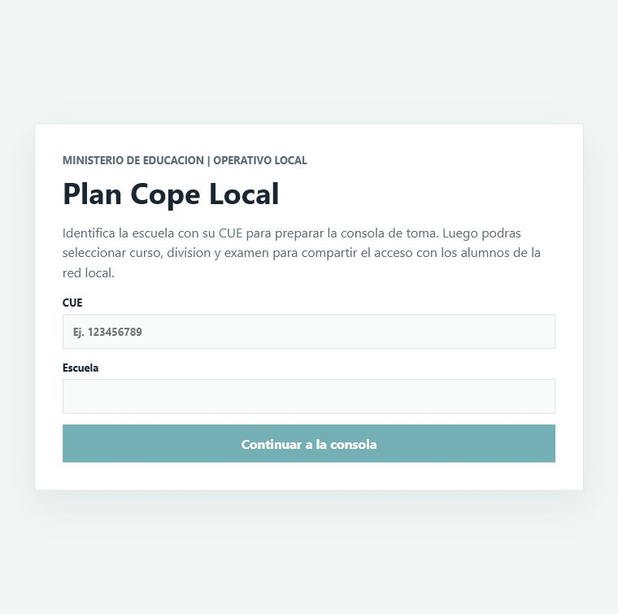
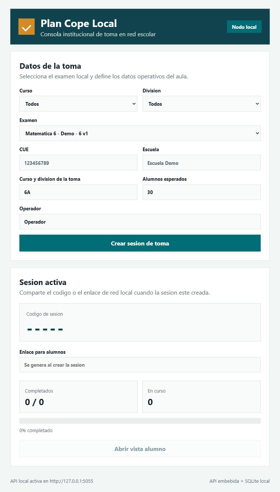

# Plan Cope — Informe Ejecutivo de Estado

**Plataforma de evaluaciones offline-first para la Provincia de Corrientes.**
500–2000 escuelas · 20K–100K estudiantes · .NET 8 · PostgreSQL + SQLite

---

## Estado general: Fase 1 — Fundaciones técnicas (cerrada)

**Resultado de la fase**: base técnica completa y compilando en limpio (`dotnet build PlanCope.slnx`), lista para pasar a implementación funcional en la siguiente etapa.

| Área | Estado | Detalle |
|---|---|---|
| Modelo de dominio | ✅ Completo | 22 entidades centrales + 13 locales (records inmutables) |
| Value objects | ✅ Completo | `ExamCode`, `CueCode`, `Grade` con validación |
| Enums | ✅ Completo | 8 tipos (`BlockType`, `ExamStatus`, `SyncDirection`, etc.) |
| Contratos API (DTOs) | ✅ Completo | 29 tipos de request/response + source-gen JSON |
| Validación (FluentValidation) | ✅ Completo | 5 validadores registrados en DI compartido |
| Central — EF Core | ✅ Esquema | DbContext + 24 entity configurations (6 esquemas PostgreSQL) |
| Central — Migraciones SQL | ✅ Completo | Migracion inicial EF Core generada para PostgreSQL |
| Central — Controladores | ✅ Fase 2 | `HealthController`, Auth y Exam inicial implementados |
| Local — SQLite + DbUp | ✅ Completo | 11 tablas, 9 índices, migraciones embebidas (001 + 002) |
| Local — Repositorios Dapper | ✅ Completo | 6 repositorios con SQL completo (User, Exam, Session, Attempt, Outbox, SyncState) |
| Local — API bootstrap | ✅ Completo | API local arranca, inicializa SQLite y expone health endpoint |
| Local — WinForms Host | ✅ Shell | `MainForm` inicia la API local y hospeda React en WebView2 |
| Sync — Outbox local | ✅ Esquema | Tabla `sync_outbox` con reintentos y backoff |
| Sync — Motor | ⏭️ Fase 3 | Contratos definidos; falta worker/service |
| Auth / JWT | ✅ Completo | Middleware JWT + login, refresh y perfil en Central |
| Logging (Serilog) | ⏭️ Fase 3 | Paquete declarado; falta configuración |
| Swagger | ⏭️ Fase 3 | Paquete declarado; falta cableado |
| Hashing (BCrypt) | ✅ Completo | Verificacion BCrypt integrada en login central |
| Docker Compose | ⏭️ Fase 3 | Carpeta `deploy/` creada; faltan archivos |
| Frontend (React/Vite) | ✅ Base | Workspace `ClientApp` dentro del host local, servido por WebView2 |
| Tests | ⏭️ Fase 3 | Proyectos creados; falta implementar casos |
| CI/CD | ⏭️ Fase 3 | Sin workflows todavía |

---

## Arquitectura

```
┌──────────────────────────────────┐     ┌──────────────────────────────┐
│         CENTRAL (Nube)           │     │       LOCAL (Escuela)        │
│                                  │     │                              │
│  PostgreSQL 16                   │     │  SQLite (WAL)                │
│  EF Core (6 schemas)             │     │  Dapper + DbUp               │
│  ASP.NET Core Web API            │     │  ASP.NET Core Web API        │
│                                  │     │  WinForms + WebView2 Host    │
│  ┌──────────────────────────┐   │     │                              │
│  │ Sync Protocol:           │   │     │  ┌────────────────────────┐  │
│  │  Pull (cursor-based) ◄───┼───┼─────┼──┤ sync_outbox (push)     │  │
│  │  Push (idempotent) ──────┼───┼─────┼──┤ con reintentos         │  │
│  └──────────────────────────┘   │     │  └────────────────────────┘  │
└──────────────────────────────────┘     └──────────────────────────────┘
```

**Decisión clave**: dos ORM distintos — EF Core para el modelo relacional complejo del central, Dapper + SQL crudo para el nodo local liviano.

---

## Stack tecnológico

| Capa | Tecnología | Versión |
|---|---|---|
| Runtime | .NET | 8.0 |
| Central DB | PostgreSQL + Npgsql EF Core | 8.0.4 |
| Local DB | SQLite + Dapper + DbUp | 8.0.6 / 2.1.35 / 5.0.40 |
| Validación | FluentValidation | 11.11.0 |
| Serialización | System.Text.Json (source-gen) | — |
| Desktop | Windows Forms | — |
| Auth | JWT Bearer + BCrypt | 8.0.6 / 4.0.3 |
| Logging (plan) | Serilog | 8.0.1 |
| API Docs (plan) | Swashbuckle | 6.6.2 |
| Actualización (plan) | Velopack | 0.0.1191 |
| Embed. browser (plan) | WebView2 | 1.0.2792.45 |

---

## Estructura del repositorio

```
.
├── PlanCope.slnx
├── Directory.Build.props          # Nullable, ImplicitUsings, TreatWarningsAsErrors
├── Directory.Packages.props       # Versiones centralizadas de NuGet
├── global.json                    # SDK 10.0.301
├── NuGet.config
├── src/
│   ├── Shared/
│   │   ├── PlanCope.Shared.Domain/        # Entidades, value objects, enums
│   │   ├── PlanCope.Shared.Contracts/     # DTOs, source-gen JSON context
│   │   └── PlanCope.Shared.Infrastructure/ # FluentValidation, DI extensions
│   ├── Central/
│   │   ├── PlanCope.Central.Api/          # Web API + EF Core DbContext
│   │   └── PlanCope.Central.Migrations/   # Design-time factory
│   └── Local/
│       ├── PlanCope.Local.Api/            # Web API + Dapper repos + DbUp
│       └── PlanCope.Local.Host/           # WinForms shell + React/WebView2 host
├── tests/
│   ├── PlanCope.Central.Api.Tests/
│   ├── PlanCope.Local.Api.Tests/
│   ├── PlanCope.Shared.Tests/
│   ├── PlanCope.E2E.Tests/
│   └── PlanCope.SyncCompat.Tests/
└── deploy/                                # Docker y assets de despliegue (vacío)
```

---

## Fase 2 — Backend central funcional inicial (cerrada)

**Resultado de la fase**: Central API ya tiene migracion inicial PostgreSQL, autenticacion JWT/BCrypt y endpoints funcionales base para examenes. La solucion compila y ejecuta tests sin fallas (`dotnet build PlanCope.slnx`, `dotnet test PlanCope.slnx --no-build`).

| Entregable | Estado | Detalle |
|---|---|---|
| Migracion PostgreSQL | ✅ Completo | `InitialCreate` generada en `PlanCope.Central.Migrations` |
| Auth central | ✅ Completo | `POST /api/auth/login`, `POST /api/auth/refresh`, `GET /api/auth/me` |
| JWT Bearer | ✅ Completo | Middleware configurado con esquema Bearer por defecto |
| Hashing | ✅ Completo | Validacion de password con BCrypt |
| Examenes central | ✅ Inicial | Listado/creacion de examenes, versiones y upsert de bloques |
| Seguridad de secretos | ✅ Base | `Auth:SigningKey` requerido por configuracion externa |

---

## Próxima fase: Sync, operación y calidad

1. **Implementar motor de sync** — outbox worker local + pull/push endpoints en Central
2. **Implementar Publication** — paquetes, targets y flujo de publicacion
3. **Docker Compose** — PostgreSQL + Central API para desarrollo local
4. **Swagger/OpenAPI** — documentacion de endpoints y auth
5. **Serilog** — logging estructurado y correlacion de sync
6. **Tests reales** — Auth, Exams, repositorios locales y compatibilidad de sync
7. **CI/CD** — GitHub Actions (build + test + lint)
8. **Frontend React/Vite** — consolidar `ClientApp`, componentes compartidos y flujo de operador
9. **Hardening desktop** — Velopack y empaquetado `.exe`

---

## Estado del host local

El host local ya no dibuja la interfaz con controles WinForms: ahora arranca la API embebida y carga una app React dentro de WebView2.

| Componente | Estado | Detalle |
|---|---|---|
| Shell nativo | ✅ Completo | `MainForm` administra ciclo de vida de la API y WebView2 |
| Frontend local | ✅ Base | Vite + React + TypeScript en `src/Local/PlanCope.Local.Host/ClientApp` |
| Puente nativo | ✅ Completo | `window.chrome.webview` recibe contexto del host |
| API local | ✅ Base | CORS acotado para origen del host React |
| Build integrado | ✅ Completo | `dotnet build` ejecuta `npm run build` del frontend |

## Capturas




