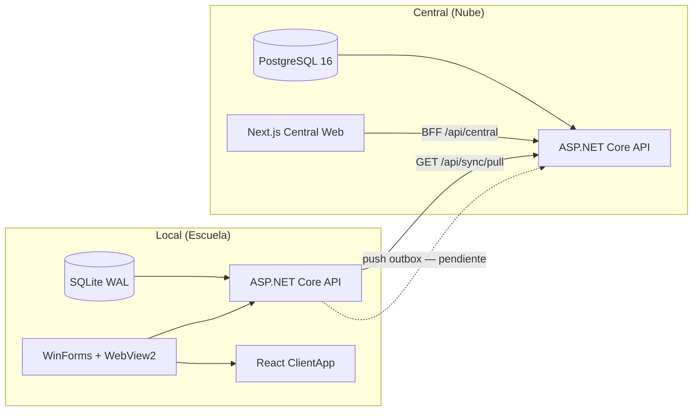

# Plan Cope

**Plataforma de evaluaciones offline-first para la Provincia de Corrientes.**

500–2000 escuelas · 20K–100K estudiantes · .NET 8 · PostgreSQL + SQLite

---

## Estado general: Fase 3 en curso — Sync, publicación y operación

La base técnica (Fases 1 y 2) está cerrada y compilando. El proyecto avanza hacia un flujo end-to-end: **crear examen en la nube → publicar → descargar en el nodo local → operar toma en la escuela**.

| Área | Estado | Detalle |
|---|---|---|
| Modelo de dominio | ✅ Completo | 22 entidades centrales + 13 locales (records inmutables) |
| Value objects | ✅ Completo | `ExamCode`, `CueCode`, `Grade` con validación |
| Enums | ✅ Completo | 8 tipos (`BlockType`, `ExamStatus`, `SyncDirection`, etc.) |
| Contratos API (DTOs) | ✅ Completo | Auth, Exams, Sync y Local con source-gen JSON |
| Validación (FluentValidation) | ✅ Completo | Validadores registrados en DI compartido |
| Central — EF Core | ✅ Esquema | DbContext + 24 entity configurations (6 esquemas PostgreSQL) |
| Central — Migraciones SQL | ✅ Completo | `InitialCreate` para PostgreSQL |
| Central — Auth | ✅ Completo | Login, refresh, perfil; JWT Bearer + BCrypt |
| Central — Exámenes | ✅ Funcional | CRUD, versiones, bloques, assets, documento unificado |
| Central — Publicación | ✅ Inicial | `POST /api/exams/versions/{id}/publish` + paquetes y targets |
| Central — Sync pull | ✅ Inicial | `GET /api/sync/pull` con cursor y paquetes publicados |
| Central — Swagger | ✅ Dev | OpenAPI + JWT en entorno Development |
| Central Web (Next.js) | ✅ Funcional | Login, dashboard, exámenes, builder online y publicación |
| Local — SQLite + DbUp | ✅ Completo | 11 tablas, 9 índices, migraciones embebidas |
| Local — Repositorios Dapper | ✅ Completo | User, Exam, Session, Attempt, Outbox, SyncState |
| Local — API | ✅ Funcional | Health, sesiones, importación JSON, sync status y pull |
| Local — Sync pull | ✅ Inicial | `LocalExamPullService` + `POST /api/sync/pull-exams` |
| Local — Sync push / outbox worker | ⏭️ Pendiente | Tabla `sync_outbox` lista; sin worker ni endpoint push central |
| Local — WinForms Host | ✅ Shell | `MainForm` + WebView2 hospeda React (operador + alumno) |
| Local — ClientApp | ✅ Base | Gate escuela, consola de sesiones, toma de examen, builder local |
| Tests .NET | 🟡 Parcial | `LocalExamImportTests`, `LocalSessionFlowTests` |
| Tests Central Web | 🟡 Parcial | Vitest: schemas Zod y mappers |
| Logging (Serilog) | ⏭️ Pendiente | Paquete declarado; sin configuración |
| Docker Compose | ⏭️ Pendiente | Carpeta `deploy/` vacía |
| CI/CD | ⏭️ Pendiente | Sin workflows de GitHub Actions |
| Empaquetado desktop (Velopack) | ⏭️ Pendiente | Planificado para distribución `.exe` |

---

## Arquitectura



**Decisión clave:** EF Core en Central para el modelo relacional complejo; Dapper + SQL crudo en el nodo local liviano.

---

## Stack tecnológico

| Capa | Tecnología | Versión |
|---|---|---|
| Runtime | .NET SDK | 10.0.301 (target .NET 8) |
| Central DB | PostgreSQL + Npgsql EF Core | 8.0.4 |
| Local DB | SQLite + Dapper + DbUp | 8.0.6 / 2.1.35 / 5.0.40 |
| Central API | ASP.NET Core + JWT + Swagger | 8.x |
| Central Web | Next.js + React + Zod + dnd-kit | 16.2.9 / 19.2.7 |
| Local UI | Vite + React + TypeScript | latest |
| Validación | FluentValidation + Zod | 11.11.0 / 4.4.3 |
| Auth | JWT Bearer + BCrypt | 8.0.6 / 4.0.3 |
| Desktop | Windows Forms + WebView2 | — |

---

## Estructura del repositorio

```
.
├── PlanCope.slnx
├── package.json                   # npm workspaces (Central Web + Local Host UI)
├── Directory.Build.props
├── Directory.Packages.props
├── global.json
├── src/
│   ├── Shared/
│   │   ├── PlanCope.Shared.Domain/
│   │   ├── PlanCope.Shared.Contracts/
│   │   └── PlanCope.Shared.Infrastructure/
│   ├── Central/
│   │   ├── PlanCope.Central.Api/          # API REST + EF Core
│   │   ├── PlanCope.Central.Migrations/
│   │   └── PlanCope.Central.Web/          # Next.js: builder y admin central
│   └── Local/
│       ├── PlanCope.Local.Api/            # API offline + Dapper + sync pull
│       └── PlanCope.Local.Host/           # WinForms + ClientApp React
├── tests/
│   ├── PlanCope.Central.Api.Tests/
│   ├── PlanCope.Local.Api.Tests/          # tests implementados
│   ├── PlanCope.Shared.Tests/
│   ├── PlanCope.E2E.Tests/
│   └── PlanCope.SyncCompat.Tests/
├── docs/
│   ├── central-web-next-builder.md
│   ├── local-exam-format.md
│   └── exam-builder-implementation-plan.md
└── deploy/                                # vacío — Docker pendiente
```

---

## Flujo funcional actual

### 1. Central (autoría y publicación)

1. Levantar **Central API** (PostgreSQL + migraciones aplicadas).
2. Levantar **Central Web**: `npm run central:web:dev`.
3. Iniciar sesión en `/login`.
4. Crear examen → versión → editar en el **builder** (`/exams/{id}/versions/{versionId}/builder`).
5. Guardar bloques, previsualizar y **publicar** por materia, grado y división opcional.

El builder incluye pestañas: datos generales, preguntas (drag-and-drop), vista previa, exportar JSON y publicar.

### 2. Local (distribución y toma)

1. Configurar `sync_state` en SQLite (`central_url`, `node_id`, `central_access_token`).
2. Ejecutar pull: `POST /api/sync/pull-exams` o botón **Actualizar** en el Host.
3. Abrir el Host local: identificación por CUE → consola de sesiones → acceso alumno en red local.

Ver [`docs/central-web-next-builder.md`](docs/central-web-next-builder.md) para comandos y configuración de sync.

---

## API Central (endpoints principales)

| Método | Ruta | Descripción |
|---|---|---|
| `GET` | `/api/health` | Health check + DB |
| `POST` | `/api/auth/login` | Autenticación |
| `POST` | `/api/auth/refresh` | Renovar token |
| `GET` | `/api/auth/me` | Perfil del usuario |
| `GET/POST` | `/api/exams` | Listar / crear exámenes |
| `GET/POST` | `/api/exams/{id}/versions` | Versiones |
| `PUT` | `/api/exams/versions/{id}/document` | Guardar documento del builder |
| `POST` | `/api/exams/versions/{id}/publish` | Publicar paquete |
| `GET` | `/api/sync/pull` | Pull cursor-based de paquetes publicados |

Swagger UI disponible en Development: `/swagger`.

---

## API Local (endpoints principales)

| Método | Ruta | Descripción |
|---|---|---|
| `GET` | `/api/health` | Health check |
| `GET` | `/api/sync/status` | Estado de sync y outbox pendiente |
| `POST` | `/api/sync/pull-exams` | Descargar exámenes publicados desde Central |
| — | `/api/sessions/*` | Gestión de sesiones de toma |
| — | `/api/exams/*` | Catálogo local e importación JSON |

Formato de examen local: [`docs/local-exam-format.md`](docs/local-exam-format.md).

---

## Cómo ejecutar

### Requisitos

- .NET SDK 10.0.301+
- Node.js 20+ y npm
- PostgreSQL 16 (para Central API)
- Windows (para el Host WinForms + WebView2)

### Comandos

```powershell
# Instalar dependencias JS (workspaces)
npm install

# Backend
dotnet build PlanCope.slnx
dotnet test PlanCope.slnx

# Central Web
npm run central:web:dev

# Tests del builder (Central Web)
npm run test --workspace plancope-central-web

# Migraciones Central (desde PlanCope.Central.Migrations)
dotnet ef database update
```

### Configuración Central API

- Connection string: `CentralDatabase` en `appsettings.Development.json`
- **Obligatorio:** `Auth:SigningKey` con un secreto seguro

---

## Fases completadas

### Fase 1 — Fundaciones técnicas

Base técnica completa: dominio compartido, contratos, validación, esquemas EF Core y SQLite, repositorios Dapper, shell WinForms + WebView2.

### Fase 2 — Backend central funcional

Migración PostgreSQL, autenticación JWT/BCrypt y endpoints base de exámenes. La solución compila y ejecuta tests (`dotnet build PlanCope.slnx`, `dotnet test PlanCope.slnx`).

---

## Próximos pasos

1. **Sync push** — worker de outbox local + `POST /api/sync/push` en Central
2. **Docker Compose** — PostgreSQL + Central API para desarrollo
3. **Serilog** — logging estructurado y correlación de sync
4. **Tests ampliados** — Auth central, sync compat, E2E
5. **CI/CD** — GitHub Actions (build + test + lint)
6. **Velopack** — empaquetado y actualización del Host `.exe`

---

## Documentación adicional

- [Central Web y distribución](docs/central-web-next-builder.md)
- [Formato JSON de examen local](docs/local-exam-format.md)
- [Plan del exam builder](docs/exam-builder-implementation-plan.md)
