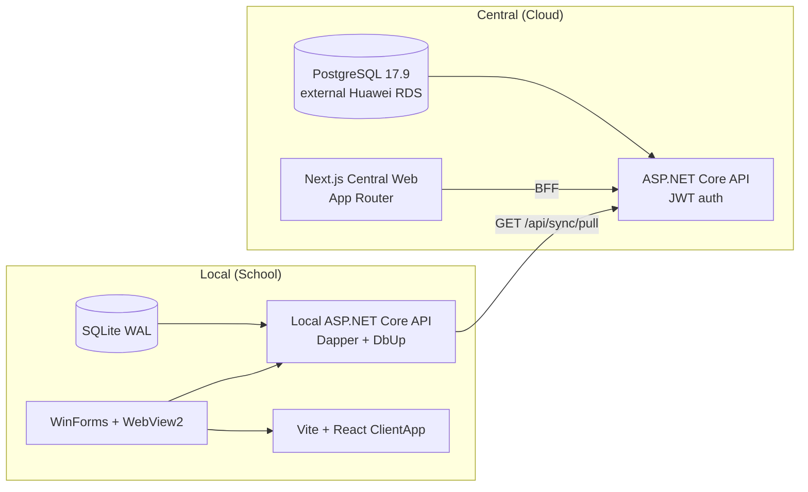

# Plan Cope

**Offline-first assessment platform for schools in the Province of Corrientes, Argentina.**

500–2000 schools · 20K–100K students · .NET 8 · PostgreSQL (Central) + SQLite (Local/offline)

**Status: in production.** Central (API + Web) has been live since release `0.1.0`.

---

## What this is

Plan Cope lets the provincial education authority author and publish exams in the
cloud, distribute them to schools, and run exam sessions on site — even when the
school has no reliable internet connection.

It is built around two environments with different constraints:

- **Central (cloud):** authoring, publishing, and administration. A Next.js web
  app talks to an ASP.NET Core API backed by PostgreSQL. This is the *only* place
  exams are authored.
- **Local (school):** an offline node that downloads published exams and runs the
  exam session. It is a WinForms desktop shell hosting a React UI in WebView2,
  with its own local ASP.NET Core API and a SQLite database. Authoring has been
  removed from the Local side; the desktop host now only administers sessions.

The connectivity gap is bridged by a cursor-based *sync pull*: the Local node
fetches published exam packages from Central and stores them locally. During a
session the node runs entirely against local SQLite.

**Key architectural decision:** EF Core on the Central side for the complex
relational model; Dapper with raw SQL on the lightweight Local node.

---

## Architecture


```mermaid
flowchart LR
  subgraph Central["Central (Cloud)"]
    PG[(PostgreSQL 17.9<br/>external Huawei RDS)]
    API["ASP.NET Core API<br/>JWT auth"]
    WEB["Next.js Central Web<br/>App Router"]
    PG --> API
    WEB -->|BFF| API
  end

  subgraph Local["Local (School)"]
    SQL[(SQLite WAL)]
    LAPI["Local ASP.NET Core API<br/>Dapper + DbUp"]
    HOST["WinForms + WebView2"]
    UI["Vite + React ClientApp"]
    SQL --> LAPI
    HOST --> LAPI
    HOST --> UI
  end

  LAPI -->|GET /api/sync/pull| API
```

### The two frontends are not the same stack

This trips people up, so it's worth stating plainly:

- **Central Web** (`src/Central/PlanCope.Central.Web`) is **Next.js with the App
  Router**. It runs as a standalone Node.js server (`.next/standalone`), talks to
  Central API as a BFF, and is the only place exams are authored.
- **Local Host ClientApp** (`src/Local/PlanCope.Local.Host/ClientApp`) is **Vite +
  React** — it does **not** use Next.js, has no server-side rendering, and is
  built as a static bundle embedded into the WinForms host's WebView2 control.

They share no framework code. They do share the root npm workspace (one
`package.json`, one `package-lock.json`) purely for tooling convenience — see
[Local development](#local-development).

---

## Repository layout

```
.
├── PlanCope.slnx                  # .NET solution (.slnx format)
├── package.json                   # npm workspaces (Central Web + Local Host UI)
├── Directory.Build.props
├── Directory.Packages.props       # central NuGet version management
├── global.json                    # pins .NET SDK
├── src/
│   ├── Shared/
│   │   ├── PlanCope.Shared.Domain/          # entities, value objects, enums
│   │   ├── PlanCope.Shared.Contracts/       # API DTOs (source-generated JSON)
│   │   └── PlanCope.Shared.Infrastructure/  # validation, shared services
│   ├── Central/
│   │   ├── PlanCope.Central.Api/            # ASP.NET Core REST API + EF Core
│   │   ├── PlanCope.Central.Migrations/     # EF Core migrations
│   │   └── PlanCope.Central.Web/            # Next.js (App Router) — authoring + admin
│   └── Local/
│       ├── PlanCope.Local.Api/              # offline API + Dapper + sync pull
│       └── PlanCope.Local.Host/             # WinForms + WebView2 shell
│           └── ClientApp/                   # Vite + React UI (embedded, NOT Next.js)
├── tools/
│   ├── PlanCope.RosterCrypto/               # roster envelope encryption (library + CLI)
│   ├── PlanCope.RosterCrypto.Tests/
│   └── PlanCope.RosterReleaseTool/          # roster bundle packing CLI, references Central.Api
├── tests/
│   ├── PlanCope.Central.Api.Tests/
│   ├── PlanCope.Local.Api.Tests/
│   ├── PlanCope.Local.Host.Tests/           # Windows-only: covers the File.Move gotcha, see below
│   ├── PlanCope.Shared.Tests/
│   ├── PlanCope.E2E.Tests/                  # references BOTH Central.Api and Local.Host
│   └── PlanCope.SyncCompat.Tests/           # references Shared.Contracts only
├── deploy/
│   ├── compose.dev.yml             # local dev: Postgres 17 + migrate + api + web
│   ├── compose.ci.yml              # CI-only build + smoke test (no published ports)
│   ├── smoke.sh                    # CI smoke test (migrate + API readiness)
│   └── certs/huawei-rds-ca.pem     # public CA for the production RDS
├── scripts/                        # build/sign/publish PowerShell + bash helpers
├── docs/                           # deep-dive documentation (see links at the end)
└── .github/workflows/
    ├── ci.yml                      # orchestrator: detects changed modules, gates the PR
    ├── ci-central-api.yml          # reusable: Central API + Shared + roster tools (ubuntu)
    ├── ci-central-web.yml          # reusable: Central Web / Next.js (ubuntu)
    ├── ci-local-app.yml            # reusable: Local API + Host + ClientApp (windows)
    ├── ci-containers.yml           # reusable: compose build + smoke test (ubuntu)
    ├── ci-security.yml             # reusable: dependency + image scanning, SBOM, attestations
    └── release.yml                 # image + installer release (manual only)
```

`PlanCope.RosterReleaseTool` and `PlanCope.E2E.Tests` are easy to miss when
reasoning about module boundaries because they cross them: the tool references
`Central.Api` directly, and the E2E suite references both `Central.Api` and
`Local.Host`. See [Continuous integration](#continuous-integration) for how CI
actually treats them.

---

## Domain model

- **Entities:** 22 core entities in the Central relational model and 13 Local
  entities (immutable `record` types).
- **Value objects:** `ExamCode`, `CueCode`, `Grade` — each self-validating.
- **Enums:** 8 types, including `BlockType`, `ExamStatus`, and `SyncDirection`.
- **Contracts:** API DTOs for Auth, Exams, Sync, and Local, serialized with
  source-generated JSON.
- **Validation:** FluentValidation validators registered in shared DI.

---

## Roster (padrón) encryption

The nominal roster — student names and DNIs for **227,598 students across 1,440
CUEs** (schools, grouped into 13,429 sections) — travels **embedded and
encrypted inside the desktop installer**. The operator only ever decrypts the
single CUE they type in; the other 1,439 stay encrypted at rest.

Encryption is **envelope encryption per school (CUE)**:

- A per-school data-encryption key (DEK) is random, 256-bit, and used with
  **AES-256-GCM**.
- DEKs are wrapped by a master key derived from the activation passphrase using
  **Argon2id** (random salt per bundle).
- The manifest holds only CUE, byte offset, length, SHA-256, and the Argon2id
  parameters used — **zero nominal data**. Verified directly against the real
  bundle: it decrypts by CUE, rejects a wrong passphrase, rejects a
  non-existent CUE, and none of 9 sampled names/surnames/DNIs/school names
  appear anywhere in the ciphertext bytes.

The exact binary container format, header layout, and CLI parameters are
documented in [`docs/roster-bundle-format.md`](docs/roster-bundle-format.md).
Activation behavior on the host is described in
[`docs/activation-passphrase.md`](docs/activation-passphrase.md).

### Packing a bundle

```bash
dotnet run --project tools/PlanCope.RosterCrypto -- pack \
  --input <dir> --output <bundle.enc> --passphrase <p> \
  [--memory-kib N --iterations N --parallelism N]
```

`<dir>` must contain `<9-digit CUE>-<year>.roster.json` files at its **first
level** — the CLI uses `TopDirectoryOnly`, it does not recurse.

### Argon2id parameters — closed decision, measured

**64 MiB / 3 iterations / parallelism 1.**

Measured on a 16-core dev box:

| Parameters | Time |
|---|---|
| 19 MiB / 2 / 1 (code default — the OWASP floor) | 57 ms |
| **64 MiB / 3 / 1 (chosen)** | **198 ms** |
| 128 MiB / 2 / 1 | 317 ms |
| 256 MiB / 2 / 1 | 628 ms |

**Why:** the bundle travels on the machine, so an attacker who obtains it can
brute-force the passphrase offline — the OWASP floor is calibrated for an
online-attack threat model and is not enough here. Activation happens exactly
once per machine, so 198 ms of one-time cost is negligible for the operator.

**Honest gap:** this has **not** been measured on real school hardware — only
on a 16-core development machine. Before shipping a release with a genuinely
encrypted roster, re-measure on representative field hardware; if activation
crawls on an old school machine, the parameters need revisiting.

---

## Technology stack

| Layer | Technology | Version |
|---|---|---|
| Runtime | .NET SDK (targets .NET 8) | 10.0.301 |
| Central DB | PostgreSQL on external Huawei Cloud RDS + Npgsql EF Core | 17.9 / 8.0.4 |
| Local DB | SQLite + Dapper + DbUp | 8.0.6 / 2.1.35 / 5.0.40 |
| Central API | ASP.NET Core + JWT + Swagger | 8.x |
| Central Web | Next.js (App Router) + React + Zod + dnd-kit | 16.x / 19.x |
| Local UI | Vite + React + TypeScript | latest |
| Validation | FluentValidation + Zod | 11.11.0 / 4.4.3 |
| Auth | JWT Bearer + BCrypt | 8.0.6 / 4.0.3 |
| Roster crypto | Argon2id + AES-256-GCM (Konscious) | 1.3.1 |
| Desktop | Windows Forms + WebView2 + Velopack | — / 1.0.2792.45 / 0.0.1251 |

---

## Local development

### Prerequisites

- .NET 8 SDK (the repo pins SDK **10.0.301** in `global.json`; the projects
  target `net8.0`)
- Node.js **24** and npm
- Docker (for the Compose-based stack)
- Windows only if you need to build/run the WinForms host (`net8.0-windows`)

### Run the full Central stack with Docker Compose

`deploy/compose.dev.yml` runs Postgres 17, applies EF Core migrations, then
starts the API and Central Web with published ports:

```bash
docker compose -f deploy/compose.dev.yml up
```

- API: `http://localhost:8080`
- Central Web: `http://localhost:3000`
- Postgres: `localhost:5432`

`POSTGRES_PASSWORD` is the only sensitive variable this file defaults for local
use. Do not reuse those values anywhere else. This file, like `compose.ci.yml`,
is **local/CI parity only** — neither is production. Production does not run
Postgres in a container at all (see [Database](#database)).

### Native builds

```bash
# .NET
dotnet build PlanCope.slnx
dotnet test PlanCope.slnx

# JavaScript workspaces (Central Web + Local Host UI)
npm ci
npm run build --workspaces
```

Then point `ClientApp` / the Host at a locally running Central API.

### Logging in locally (and in production)

`POST /api/auth/login` expects:

```json
{ "Username": "<email>", "Password": "<password>" }
```

The field is **`Username`, not `email`** — sending `email` returns `400`. A
correct login returns `accessToken` and `user`; a wrong password returns `401`.
The token carries `role` and `roster_scope` claims (see decision 13 in
[`docs/plan-cicd-batches.md`](docs/plan-cicd-batches.md) for what `roster_scope`
means).

### CI-only Compose

`deploy/compose.ci.yml` has the same service shape as `compose.dev.yml` but no
published ports and requires every sensitive variable with no default. It
exists **only** for the CI `containers` job (build + smoke test) and uses
Postgres 17 — not the production database. Coolify never uses this file and
production does not run through it.

---

## Continuous integration

CI is split **one reusable `workflow_call` file per module**, plus an
orchestrator (`ci.yml`) that decides which modules a given push or PR actually
touched. This exists because the old, monolithic four-job pipeline ran the
*entire* test suite — including the Windows desktop Host build — on every
single change, even a one-line edit to Central Web.

### Why the gate job exists

GitHub branch protection on `main` requires specific status *contexts* to
report on a PR before it can merge, with `strict` mode (the branch must be
up to date) and `enforce_admins` (no bypass, not even for the repo owner).

If each module's workflow reported its own context directly and PRs used
`paths:` filters to skip irrelevant ones, a PR that never touches, say,
`containers`, would never make that context report at all — and a *required*
context that never reports leaves the PR **permanently blocked**, with no way
to merge it, ever (this was hit and cost real time in an earlier session of
this project).

The fix: only **one** job, `ci`, is a required status check. It always runs
(`if: always()`), waits on every module job via `needs`, and fails if any of
them failed or was cancelled — passing if the rest either succeeded or were
skipped. Individual module jobs are invoked with an `if:` condition based on
what changed, so an untouched module's job is *skipped*, not *absent* — and a
skipped `needs` dependency still lets `ci` report.

> **Branch protection itself is not touched by this change.** Updating the
> required contexts (removing `dotnet`/`js`/`containers`/`security`, adding
> `ci`) is a deliberate follow-up once the gate job is confirmed reporting
> green on a real PR — see the PR description for this change.

### What runs when

| Reusable workflow | Runner | Triggered by changes to |
|---|---|---|
| `ci-central-api.yml` | `ubuntu-latest` | `src/Central/PlanCope.Central.Api/**`, `src/Central/PlanCope.Central.Migrations/**`, `tests/PlanCope.Central.Api.Tests/**`, `tools/PlanCope.RosterReleaseTool/**`, or **any** shared-code path |
| `ci-central-web.yml` | `ubuntu-latest` | `src/Central/PlanCope.Central.Web/**` only |
| `ci-local-app.yml` | `windows-latest` | `src/Local/**`, `tests/PlanCope.Local.Api.Tests/**`, `tests/PlanCope.Local.Host.Tests/**`, `tests/PlanCope.E2E.Tests/**`, or **any** shared-code path |
| `ci-containers.yml` | `ubuntu-latest` | `deploy/**`, both Dockerfiles, or the Central API/Web source they `COPY` |
| `ci-security.yml` | `ubuntu-latest` | any of the above (it scans dependencies and images across the whole backend/frontend surface) |

A change under `.github/workflows/**` always runs **every** module — a CI
change that doesn't test itself is worthless. A change under any "shared"
path (`src/Shared/**`, `tests/PlanCope.Shared.Tests/**`,
`tests/PlanCope.SyncCompat.Tests/**`, `tools/PlanCope.RosterCrypto*/**`,
`Directory.Packages.props`, `PlanCope.slnx`, `.editorconfig`) is real shared
code, not an isolated module — it drags in `central-api`, `local-app`, and
`containers` (all three actually build against it), but **not** `central-web`,
which has no dependency on the .NET shared projects.

**Cross-module edge cases, called out on purpose:**

- `tools/PlanCope.RosterReleaseTool` references `Central.Api` directly, so it
  is treated as part of the `central-api` filter, not `shared`, even though it
  lives under `tools/`.
- `tests/PlanCope.E2E.Tests` references **both** `Central.Api` and
  `Local.Host`. It runs inside the `local-app` job (it needs the Windows-only
  Host build anyway) and its own path, plus `local-app` and shared-path
  changes, re-run it. A `central-api`-only change does **not** currently
  re-run it — a known trade-off of drawing the module boundary this way, not
  an oversight.

**What did not change:**

- `dotnet build ... -warnaserror` is preserved in every .NET module.
- The Local module still builds and tests on `windows-latest` — see the
  `File.Move` gotcha below; do not move it to Linux.
- `deploy/smoke.sh` and `deploy/compose.ci.yml` (Postgres 17) are untouched.
- `npm ci` runs against the **root** workspace lockfile in both
  `ci-central-web.yml` and `ci-local-app.yml`, since both JS packages
  (`plancope-central-web`, `plancope-local-host-ui`) share one
  `package-lock.json`.

---

## Release and deployment

Releases are **manual only**. `.github/workflows/release.yml` is triggered by
`workflow_dispatch` and never runs automatically. Its inputs are:

- `version` — strict SemVer (e.g. `1.2.3` or `1.2.3-rc.1`)
- `channel` — `stable` or `beta`
- `target` — `staging` or `production`
- `target_url` — public base URL of the deployed Central instance
- `allow_unsigned` — explicit opt-in to build the Windows installer without an
  Authenticode signature (see [Code signing](#code-signing--no-certificate-yet))

The workflow then:

1. Validates the SemVer string and checks the git tag does not already exist.
2. Builds and pushes three Docker images to GHCR, all public:
   - `ghcr.io/geronimoserial/plan-cope-central-api`
   - `ghcr.io/geronimoserial/plan-cope-central-web`
   - `ghcr.io/geronimoserial/plan-cope-central-migrate` (runs EF Core migrations,
     one-shot job — see the `docker build --target` gotcha below)
3. Promotes mutable tags (`beta`, or `stable` + `latest`) **only after** the
   immutable tags are confirmed present in GHCR.
4. Builds and signs the Velopack Windows installer on `windows-latest` — **this
   installer never carries the roster**; see
   [The installer, with and without the roster](#the-installer-with-and-without-the-roster).
5. Runs the migration job.
6. Deploys Central API + Web to Coolify and waits for health.
7. Runs a smoke test against `target_url`.
8. Publishes a GitHub Release containing **SBOM and checksums only** — never the
   installer (decision 6 in
   [`docs/plan-cicd-batches.md`](docs/plan-cicd-batches.md)). The installer
   carries no roster in this repo, but the rule is unconditional: nothing
   installer-shaped becomes a public Release asset.

Release `0.1.0` closed with all 8 jobs green, and Central has been serving
production traffic since.

### Build/deploy separation

**GitHub Actions builds; Coolify only consumes** (decision 9). Coolify apps are
of type `docker-image` — Coolify never builds anything itself, and never sees
source code. Deploys are triggered through the Coolify API by resource UUID,
after both images are confirmed present in GHCR. The Coolify token never has
build access.

### Domains, endpoints, and Coolify configuration

Deployment endpoints, network topology, Coolify resource identifiers, and
credential provisioning state are configuration that lives **outside this
repository, on purpose** — see the closing note below.

### Database

Production uses an **external Huawei Cloud RDS for PostgreSQL 17.9** — not a
container, not the `compose.ci.yml`/`compose.dev.yml` Postgres, and not AWS.
The connection string is:

```
SSL Mode=VerifyCA;Root Certificate=/etc/ssl/certs/huawei-rds-ca.pem
```

The CA is a **public, versioned-on-purpose** file
(`deploy/certs/huawei-rds-ca.pem`), baked by the API's `Dockerfile` into both
the `runtime` **and** `migrate` build targets at that exact path.

`sslmode=verify-full` is **not reachable today**: the RDS server certificate is
issued for the instance's internal address, not the endpoint clients actually
dial, so hostname/IP validation would fail even with a fully valid CA chain.
`VerifyCA` is the correct mode given that constraint. **Never** use
`Trust Server Certificate=true`, and **never** use a plain `Require`.

### Code signing — no certificate yet

There is currently no code-signing certificate, and no free path to one:

- Let's Encrypt issues only domain-validation (DV) TLS certificates; its own
  FAQ states explicitly that it does not issue code-signing certificates.
- Every root in the Windows Trusted Root Program with a code-signing EKU is
  commercial, and since 2023 all of them require the private key to live in
  FIPS 140-2 Level 2 hardware.
- A self-signed certificate *does* sign the binary, but Windows does not trust
  it — which is arguably **worse** than shipping unsigned, because it looks
  signed without the SmartScreen reputation that comes with a trusted cert.

Real options, to evaluate when this becomes a priority: a commercial OV/EV
certificate, **Azure Trusted Signing**, or an internal ministry CA distributed
by policy to the managed school fleet.

Until one of those exists, `release.yml` refuses to produce a signed installer
without an explicit `allow_unsigned=true`, and names the artifact
`...-UNSIGNED` so it can never be mistaken for a distributable build. Windows
SmartScreen warns on every install of an unsigned build — test only, never
hand it to a school.

### The installer, with and without the roster

This is the part that surprises people, so read it carefully.

**In this repository** (public), `release.yml` builds the Windows installer
**without** the roster embedded, using `allow_unsigned=true` when there is no
signing certificate.

**The roster-bearing installer is built in a separate, private repository:**
`GeronimoSerial/plan-cope-installer`.

The reason isn't roster secrecy alone (decision 6 already covered that for
Releases) — it's that **GitHub Actions build artifacts require read access to
the repository that produced them**, and a public repository gives read access
to any GitHub account. An installer artifact containing 227,598 minors' names
and DNIs, produced as an Actions artifact in *this* repo, would be downloadable
by anyone with a GitHub account, even though it never touches a public
Release. That gap wasn't part of decision 6 and was only found later.

The private-installer workflow:

1. Checks out this public repository at a specific tag.
2. Downloads the encrypted roster bundle from a **private** Release in
   `plan-cope-installer` itself.
3. Produces the installer as a **private** artifact with a **7-day retention**.
4. Refuses to build at all without `NOMINALIZATION_DOCUMENT_HMAC_KEY` set to at
   least 32 UTF-8 bytes.

**The activation passphrase never enters CI in either repository.** The bundle
that reaches the private repo is already encrypted; the passphrase is typed by
the field operator once per machine, at activation time — see
[`docs/activation-passphrase.md`](docs/activation-passphrase.md).

---

## Configuration and secrets

Sensitive values live in **GitHub Actions secrets** or **Coolify environment
variables** (referenced here by name only — never by value). Never hardcode a
value in the repository. The names in use are:

| Name | Purpose |
|---|---|
| `COOLIFY_DEPLOY_TOKEN` | Trigger Coolify deploys by resource UUID |
| `WINDOWS_SIGNING_PFX` | Code-signing certificate for the installer (currently unset — see [Code signing](#code-signing--no-certificate-yet)) |
| `WINDOWS_SIGNING_PASSWORD` | Password for the signing certificate |
| `CENTRAL_DATABASE_CONNECTION_STRING` | Connection string for the CI migration job |
| `ConnectionStrings__CentralDatabase` | Central API database connection |
| `Auth__SigningKey` | JWT signing key |
| `GeApi__Username` | GE API username |
| `GeApi__Password` | GE API password |
| `POSTGRES_PASSWORD` | **Local dev / CI only** — Compose Postgres password |
| `NOMINALIZATION_DOCUMENT_HMAC_KEY` | **`plan-cope-installer` repo only** — required, ≥32 UTF-8 bytes, gates whether that private workflow will build at all |

---

## API reference

### Central API

| Method | Route | Description |
|---|---|---|
| `GET` | `/health/live` | Liveness probe |
| `GET` | `/health/ready` | Readiness probe (checks DB) |
| `GET` | `/api/health` | Health controller endpoint |
| `POST` | `/api/auth/login` | Authenticate — body is `{"Username": ..., "Password": ...}`, **not** `email` |
| `POST` | `/api/auth/refresh` | Refresh token |
| `GET` | `/api/auth/me` | Current user profile |
| `GET/POST` | `/api/exams` | List / create exams |
| `GET/POST` | `/api/exams/{id}/versions` | Exam versions |
| `PUT` | `/api/exams/versions/{id}/document` | Save builder document |
| `POST` | `/api/exams/versions/{id}/publish` | Publish a package |
| `GET` | `/api/sync/pull` | Cursor-based pull of published packages |

Swagger UI is available in Development at `/swagger`.

### Local API

| Method | Route | Description |
|---|---|---|
| `GET` | `/api/health` | Health check |
| `GET` | `/api/sync/status` | Sync state and pending outbox |
| `POST` | `/api/sync/pull-exams` | Download published exams from Central |
| — | `/api/sessions/*` | Exam session management |
| — | `/api/exams/*` | Local catalog and JSON import |

Exam JSON format: [`docs/local-exam-format.md`](docs/local-exam-format.md).
Offline roster preparation and import:
[`docs/roster-release.md`](docs/roster-release.md).

---

## Gotchas

Real mistakes made while building this, kept here because they cost hours and
are easy to repeat:

1. **`docker build` without `--target` builds the *last* stage.** In the
   Central API `Dockerfile`, `migrate` is the last stage — so a build without
   an explicit target published the *migration tool* as if it were the API.
   The resulting container applied migrations, exited `0`, and Coolify
   reported the app as `exited`. This was broken from the commit that
   introduced the multi-stage `Dockerfile` and stayed invisible because CI
   builds through Compose, which does declare its targets. Both real build
   paths now declare `--target` explicitly (`runtime` for the API,
   `migrate` for the migration job).
2. **`needs.<job>.outputs.*` referencing a job not listed in that job's
   `needs:` resolves to an empty string — silently, no error.** GitHub Actions
   does not fail the workflow; it just gives you `''`. This has already
   consumed a real deploy. Every job that reads another job's `needs.*` value
   must list that job in its own `needs:` array — check this explicitly when
   touching any workflow.
3. **`vpk` has no `--version` flag.** The version only appears in the banner
   printed by `vpk -h`.
4. **`vpk` names the installer with the pack id in front**
   (`PlanCope.Local.Host-stable-Setup.exe`), so a prefix filter like `Setup*`
   matches nothing.
5. **`gh run download --name X` extracts into the current directory, not into
   `X/`.** Pass `--dir X` explicitly.
6. **`File.Move` on a `FileStream` opened with `FileShare.None` succeeds on
   Linux and fails on Windows** — flushing a stream is not the same as
   closing it. This is exactly why the Local module's test job runs on
   `windows-latest` and must not move to Linux.
7. **Branch protection has `strict: true`.** A PR with all-green checks can
   still show as `BEHIND` once `main` moves — update the branch before
   expecting it to merge.

---

## TODO

1. **Measure Argon2id parameters on real school hardware.** The 64 MiB / 3
   iterations / parallelism 1 choice (198 ms) is measured on a 16-core dev
   box only — see [Argon2id parameters](#argon2id-parameters--closed-decision-measured).
   Not yet benchmarked on the machines this actually has to run on.
2. **`vpk`/`signtool` steps only run on `windows-latest` in CI/release** —
   never exercised on Linux, so a break there stays invisible until a real
   Windows CI run. See [the Velopack test matrix](docs/velopack-test-matrix.md).
3. **The installer is unsigned until a code-signing certificate exists.** See
   [Code signing](#code-signing--no-certificate-yet) for the real options.
4. **Confirm the `ci` gate reports green on a real PR, then update branch
   protection** to require `ci` instead of the old `dotnet`/`js`/`containers`/
   `security` contexts. This repository does not change branch protection
   itself — that is a deliberate, separate step.
5. **`tests/PlanCope.E2E.Tests` does not re-run on a `central-api`-only
   change**, even though it exercises `Central.Api` — a known trade-off of the
   per-module CI split (see [Continuous integration](#continuous-integration)).
   Revisit if this ever causes a real regression to slip through.

This repository is public. Deployment endpoints, network topology, Coolify
resource identifiers, and credential provisioning state are deliberately
**not** documented here — publishing the current hardening posture of a
system that holds personal data of minors would hand an attacker a checklist.
Operators track those items privately; ask the maintainer for access rather
than inferring them from this repository.

---

## Further documentation

- [Encrypted roster bundle format](docs/roster-bundle-format.md)
- [Activation passphrase](docs/activation-passphrase.md)
- [Roster release process](docs/roster-release.md)
- [Central Web and exam distribution](docs/central-web-next-builder.md)
- [Local exam JSON format](docs/local-exam-format.md)
- [Exam builder implementation plan](docs/exam-builder-implementation-plan.md)
- [CI/CD, packaging, and build/deploy decoupling plan](docs/plan-cicd-batches.md)
- [Velopack test matrix](docs/velopack-test-matrix.md)
