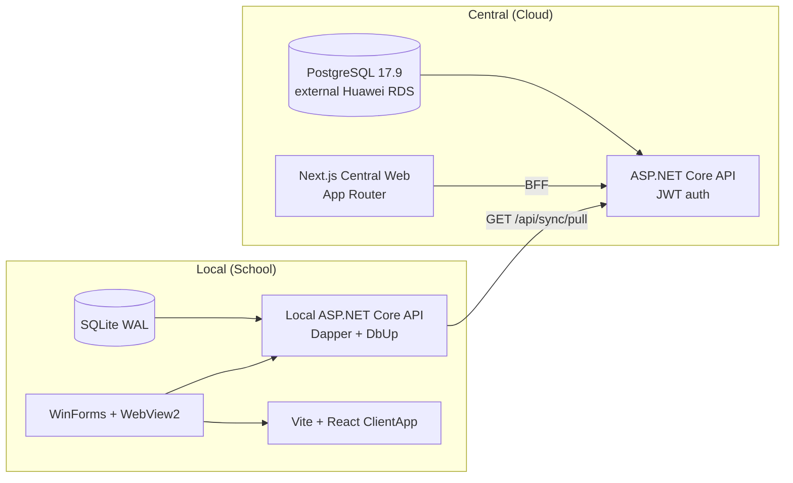

# Plan Cope

**Offline-first assessment platform for schools in the Province of Corrientes, Argentina.**

500–2000 schools · 20K–100K students · .NET 8 · PostgreSQL (Central) + SQLite (Local/offline)

---

## What this is

Plan Cope lets the provincial education authority author and publish exams in the
cloud, distribute them to schools, and run exam sessions on site — even when the
school has no reliable internet connection.

It is built around two environments with different constraints:

- **Central (cloud):** authoring, publishing, and administration. A Next.js web
  app talks to an ASP.NET Core API backed by PostgreSQL. This is the *only* place
  exams are authored.
- **Local (school):** an offline node that downloads published exams and runs the
  exam session. It is a WinForms desktop shell hosting a React UI in WebView2,
  with its own local ASP.NET Core API and a SQLite database. Authoring has been
  removed from the Local side; the desktop host now only administers sessions.

The connectivity gap is bridged by a cursor-based *sync pull*: the Local node
fetches published exam packages from Central and stores them locally. During a
session the node runs entirely against local SQLite.

**Key architectural decision:** EF Core on the Central side for the complex
relational model; Dapper with raw SQL on the lightweight Local node.

---

## Architecture


```mermaid
flowchart LR
  subgraph Central["Central (Cloud)"]
    PG[(PostgreSQL 17.9<br/>external Huawei RDS)]
    API["ASP.NET Core API<br/>JWT auth"]
    WEB["Next.js Central Web<br/>App Router"]
    PG --> API
    WEB -->|BFF| API
  end

  subgraph Local["Local (School)"]
    SQL[(SQLite WAL)]
    LAPI["Local ASP.NET Core API<br/>Dapper + DbUp"]
    HOST["WinForms + WebView2"]
    UI["Vite + React ClientApp"]
    SQL --> LAPI
    HOST --> LAPI
    HOST --> UI
  end

  LAPI -->|GET /api/sync/pull| API
```

---

## Repository layout

```
.
├── PlanCope.slnx                  # .NET solution (.slnx format)
├── package.json                   # npm workspaces (Central Web + Local Host UI)
├── Directory.Build.props
├── Directory.Packages.props       # central NuGet version management
├── global.json                    # pins .NET SDK
├── src/
│   ├── Shared/
│   │   ├── PlanCope.Shared.Domain/          # entities, value objects, enums
│   │   ├── PlanCope.Shared.Contracts/       # API DTOs (source-generated JSON)
│   │   └── PlanCope.Shared.Infrastructure/  # validation, shared services
│   ├── Central/
│   │   ├── PlanCope.Central.Api/            # ASP.NET Core REST API + EF Core
│   │   ├── PlanCope.Central.Migrations/     # EF Core migrations
│   │   └── PlanCope.Central.Web/            # Next.js (App Router) — authoring + admin
│   └── Local/
│       ├── PlanCope.Local.Api/              # offline API + Dapper + sync pull
│       └── PlanCope.Local.Host/             # WinForms + WebView2 shell
│           └── ClientApp/                   # Vite + React UI (embedded)
├── tools/
│   ├── PlanCope.RosterCrypto/               # roster envelope encryption
│   ├── PlanCope.RosterCrypto.Tests/
│   └── PlanCope.RosterReleaseTool/          # roster bundle packing CLI
├── tests/
│   ├── PlanCope.Central.Api.Tests/
│   ├── PlanCope.Local.Api.Tests/
│   ├── PlanCope.Local.Host.Tests/
│   ├── PlanCope.Shared.Tests/
│   ├── PlanCope.E2E.Tests/
│   └── PlanCope.SyncCompat.Tests/
├── deploy/
│   ├── compose.dev.yml             # local dev: Postgres 17 + migrate + api + web
│   ├── compose.ci.yml              # CI-only build + smoke test (no published ports)
│   ├── smoke.sh                    # CI smoke test (migrate + API readiness)
│   └── certs/huawei-rds-ca.pem     # public CA for the production RDS
├── scripts/                        # build/sign/publish PowerShell + bash helpers
├── docs/                           # deep-dive documentation (see links at the end)
└── .github/workflows/
    ├── ci.yml                      # build, test, containers, security scanning
    └── release.yml                 # image + installer release (manual only)
```

---

## Domain model

- **Entities:** 22 core entities in the Central relational model and 13 Local
  entities (immutable `record` types).
- **Value objects:** `ExamCode`, `CueCode`, `Grade` — each self-validating.
- **Enums:** 8 types, including `BlockType`, `ExamStatus`, and `SyncDirection`.
- **Contracts:** API DTOs for Auth, Exams, Sync, and Local, serialized with
  source-generated JSON.
- **Validation:** FluentValidation validators registered in shared DI.

---

## Roster (padrón) encryption

The nominal roster — student names and DNIs for ~227,598 students across 1,440
CUEs (schools) — travels **embedded and encrypted inside the desktop installer**.
The operator only ever decrypts the single CUE they type in; the other 1,439
stay encrypted at rest.

Encryption is **envelope encryption per school (CUE)**:

- A per-school data-encryption key (DEK) is random, 256-bit, and used with
  **AES-256-GCM**.
- DEKs are wrapped by a master key derived from the activation passphrase using
  **Argon2id** (random salt per bundle).

The exact binary container format, header layout, and CLI parameters are
documented in [`docs/roster-bundle-format.md`](docs/roster-bundle-format.md).
Activation behavior on the host is described in
[`docs/activation-passphrase.md`](docs/activation-passphrase.md).

> The default Argon2id parameters (19 MiB, 2 iterations, parallelism 1) must be
> measured and tuned on real field hardware before a production release.

---

## Technology stack

| Layer | Technology | Version |
|---|---|---|
| Runtime | .NET SDK (targets .NET 8) | 10.0.301 |
| Central DB | PostgreSQL on external Huawei Cloud RDS + Npgsql EF Core | 17.9 / 8.0.4 |
| Local DB | SQLite + Dapper + DbUp | 8.0.6 / 2.1.35 / 5.0.40 |
| Central API | ASP.NET Core + JWT + Swagger | 8.x |
| Central Web | Next.js (App Router) + React + Zod + dnd-kit | 16.x / 19.x |
| Local UI | Vite + React + TypeScript | latest |
| Validation | FluentValidation + Zod | 11.11.0 / 4.4.3 |
| Auth | JWT Bearer + BCrypt | 8.0.6 / 4.0.3 |
| Roster crypto | Argon2id + AES-256-GCM (Konscious) | 1.3.1 |
| Desktop | Windows Forms + WebView2 + Velopack | — / 1.0.2792.45 / 0.0.1251 |

---

## Local development

### Prerequisites

- .NET 8 SDK (the repo pins SDK **10.0.301** in `global.json`; the projects
  target `net8.0`)
- Node.js **24** and npm
- Docker (for the Compose-based stack)
- Windows only if you need to build/run the WinForms host (`net8.0-windows`)

### Run the full Central stack with Docker Compose

`deploy/compose.dev.yml` runs Postgres 17, applies EF Core migrations, then
starts the API and Central Web with published ports:

```bash
docker compose -f deploy/compose.dev.yml up
```

- API: `http://localhost:8080`
- Central Web: `http://localhost:3000`
- Postgres: `localhost:5432`

`POSTGRES_PASSWORD` is the only sensitive variable this file defaults for local
use. Do not reuse those values anywhere else.

### Native builds

```bash
# .NET
dotnet build PlanCope.slnx
dotnet test PlanCope.slnx

# JavaScript workspaces (Central Web + Local Host UI)
npm ci
npm run build --workspaces
```

Then point `ClientApp` / the Host at a locally running Central API.

### CI-only Compose

`deploy/compose.ci.yml` has the same service shape but no published ports and
requires every sensitive variable with no default. It exists **only** for the
CI `containers` job (build + smoke test). Coolify never uses this file and
production does not run through it.

---

## Continuous integration

`.github/workflows/ci.yml` runs on `pull_request` and `push` to `main`:

| Job | Runner | What it does |
|---|---|---|
| `dotnet` | `windows-latest` | Restore, build with warnings-as-errors, test, build the WinForms host |
| `js` | `ubuntu-latest` | `npm ci`, Vitest for both frontends, build both frontends |
| `containers` | `ubuntu-latest` | Validate + build `compose.ci.yml`, then run `deploy/smoke.sh` |
| `security` | `ubuntu-latest` | NuGet/`npm audit` vuln scans, Trivy image scans, SBOM + provenance attestation |

The `dotnet` job runs on Windows because the desktop host targets
`net8.0-windows`.

---

## Release and deployment

Releases are **manual only**. `.github/workflows/release.yml` is triggered by
`workflow_dispatch` and never runs automatically. Its inputs are:

- `version` — strict SemVer (e.g. `1.2.3` or `1.2.3-rc.1`)
- `channel` — `stable` or `beta`
- `target` — `staging` or `production`
- `target_url` — public base URL of the deployed Central instance

The workflow then:

1. Validates the SemVer string and checks the git tag does not already exist.
2. Builds and pushes three Docker images to GHCR:
   - `ghcr.io/geronimoserial/plan-cope-central-api`
   - `ghcr.io/geronimoserial/plan-cope-central-web`
   - `ghcr.io/geronimoserial/plan-cope-central-migrate` (runs EF Core migrations)
3. Promotes mutable tags (`beta`, or `stable` + `latest`) **only after** the
   immutable tags are confirmed present in GHCR.
4. Builds and signs the Velopack Windows installer on `windows-latest`.
5. Runs the migration job.
6. Deploys Central API + Web to Coolify by resource UUID and waits for health.
7. Runs a smoke test against `target_url`.
8. Publishes a GitHub Release containing **SBOM and checksums only** — never the
   installer. The installer carries the encrypted roster and this repository is
   public, so it must never be a public Release asset.

### Build/deploy separation

**GitHub Actions builds; Coolify only consumes.** Coolify
(`https://coolify.sistemas.mec.gob.ar`, self-hosted) never builds any image
itself. Deploys are triggered through the Coolify API by UUID after both images
are confirmed in GHCR. The Coolify token is never involved in the build.

### Domains

| Service | URL |
|---|---|
| Central API | `https://api.plancope.sistemas.mec.gob.ar` |
| Central Web | `https://plancope.sistemas.mec.gob.ar` |

Both are served behind a wildcard certificate for `*.sistemas.mec.gob.ar`.

### Database

Production uses an **external Huawei Cloud RDS for PostgreSQL 17.9** — not a
container managed by Coolify. TLS 1.3 is mandatory server-side. The API connects
with:

```
SSL Mode=VerifyCA;Root Certificate=/etc/ssl/certs/huawei-rds-ca.pem
```

The CA is baked into the API and migrate images from
`deploy/certs/huawei-rds-ca.pem` (committed — it is a public CA, not a secret).

`sslmode=verify-full` does **not** work today: the RDS server certificate is
issued for the instance's internal address rather than the endpoint the application
actually dials, so full hostname/IP validation fails. `VerifyCA` is used
instead. Never use `Trust Server Certificate=true`, and never use a plain
`Require`.

### Desktop packaging

The desktop host (`src/Local/PlanCope.Local.Host`) is packaged and updated with
**Velopack** as a self-contained `win-x64` application on `stable` and `beta`
channels. The `vpk` CLI and `signtool` are only available on `windows-latest`
in CI/release — they are never run on Linux.

---

## Configuration and secrets

Sensitive values live in **GitHub Actions secrets** or **Coolify environment
variables**. Never hardcode a value in the repository. The names in use are:

| Name | Purpose |
|---|---|
| `COOLIFY_DEPLOY_TOKEN` | Trigger Coolify deploys by UUID |
| `WINDOWS_SIGNING_PFX` | Code-signing certificate for the installer |
| `WINDOWS_SIGNING_PASSWORD` | Password for the signing certificate |
| `CENTRAL_DATABASE_CONNECTION_STRING` | Connection string for the CI migration job |
| `ConnectionStrings__CentralDatabase` | Central API database connection |
| `Auth__SigningKey` | JWT signing key |
| `GeApi__Username` | GE API username |
| `GeApi__Password` | GE API password |
| `POSTGRES_PASSWORD` | **Local dev only** — Compose Postgres password |

---

## API reference

### Central API

| Method | Route | Description |
|---|---|---|
| `GET` | `/health/live` | Liveness probe |
| `GET` | `/health/ready` | Readiness probe (checks DB) |
| `GET` | `/api/health` | Health controller endpoint |
| `POST` | `/api/auth/login` | Authenticate |
| `POST` | `/api/auth/refresh` | Refresh token |
| `GET` | `/api/auth/me` | Current user profile |
| `GET/POST` | `/api/exams` | List / create exams |
| `GET/POST` | `/api/exams/{id}/versions` | Exam versions |
| `PUT` | `/api/exams/versions/{id}/document` | Save builder document |
| `POST` | `/api/exams/versions/{id}/publish` | Publish a package |
| `GET` | `/api/sync/pull` | Cursor-based pull of published packages |

Swagger UI is available in Development at `/swagger`.

### Local API

| Method | Route | Description |
|---|---|---|
| `GET` | `/api/health` | Health check |
| `GET` | `/api/sync/status` | Sync state and pending outbox |
| `POST` | `/api/sync/pull-exams` | Download published exams from Central |
| — | `/api/sessions/*` | Exam session management |
| — | `/api/exams/*` | Local catalog and JSON import |

Exam JSON format: [`docs/local-exam-format.md`](docs/local-exam-format.md).
Offline roster preparation and import:
[`docs/roster-release.md`](docs/roster-release.md).

---

## TODO

1. **Measure production Argon2id parameters** (memory, iterations, parallelism)
   on real field hardware — not yet benchmarked. This blocks the first release
   that ships a genuinely encrypted roster: too high and activation crawls on an
   old school machine, too low and the encryption is decorative.
2. **`vpk`/`signtool` steps only run on `windows-latest` in CI** — never
   exercised on Linux, so a break there stays invisible until a real Windows CI
   run. See [the Velopack test matrix](docs/velopack-test-matrix.md).
3. **The installer is unsigned until a code-signing certificate exists.** A
   release run must opt in with `allow_unsigned=true`; the resulting artifact is
   named `...-UNSIGNED` and Windows SmartScreen warns on every install, so it is
   suitable for testing only and not for distribution to schools.

This repository is public. Deployment endpoints, network topology, credential
provisioning state and database bootstrap status are deliberately **not**
documented here — publishing the current hardening posture of a system that
holds personal data of minors would hand an attacker a checklist. Operators
track those items privately; ask the maintainer for access rather than inferring
them from this repository.

---

## Further documentation

- [Encrypted roster bundle format](docs/roster-bundle-format.md)
- [Activation passphrase](docs/activation-passphrase.md)
- [Roster release process](docs/roster-release.md)
- [Central Web and exam distribution](docs/central-web-next-builder.md)
- [Local exam JSON format](docs/local-exam-format.md)
- [Exam builder implementation plan](docs/exam-builder-implementation-plan.md)
- [CI/CD, packaging, and build/deploy decoupling plan](docs/plan-cicd-batches.md)
- [Velopack test matrix](docs/velopack-test-matrix.md)
