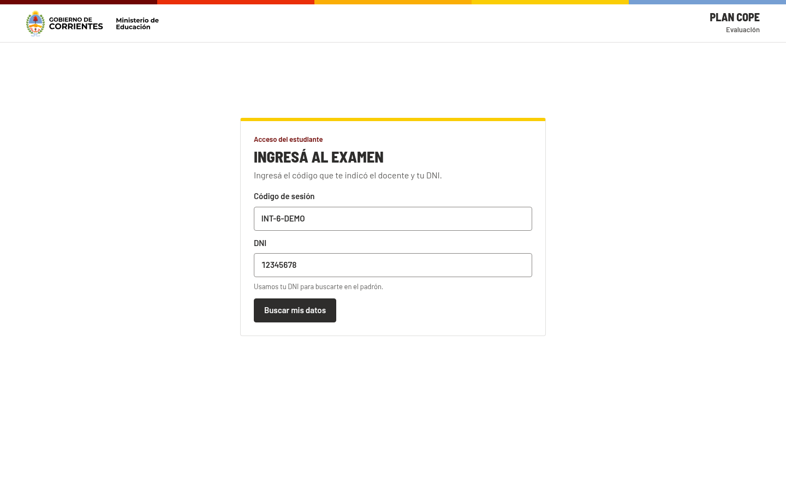
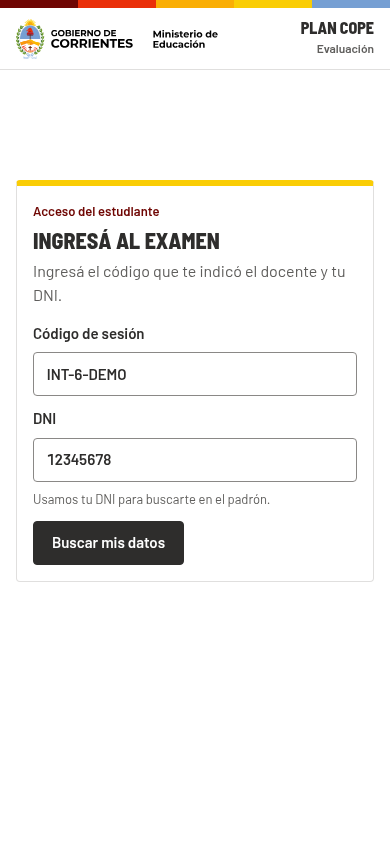
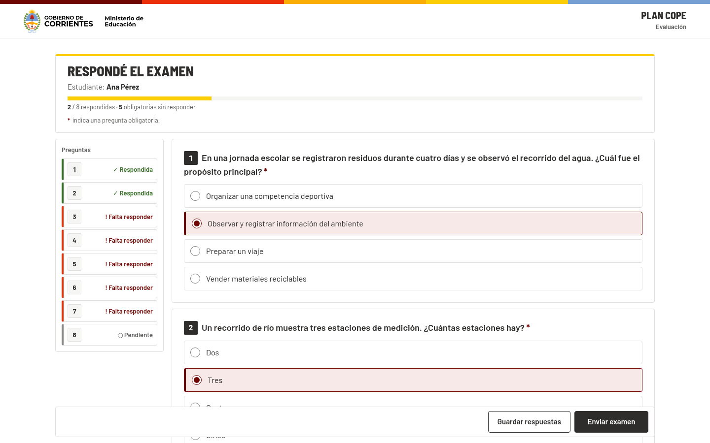
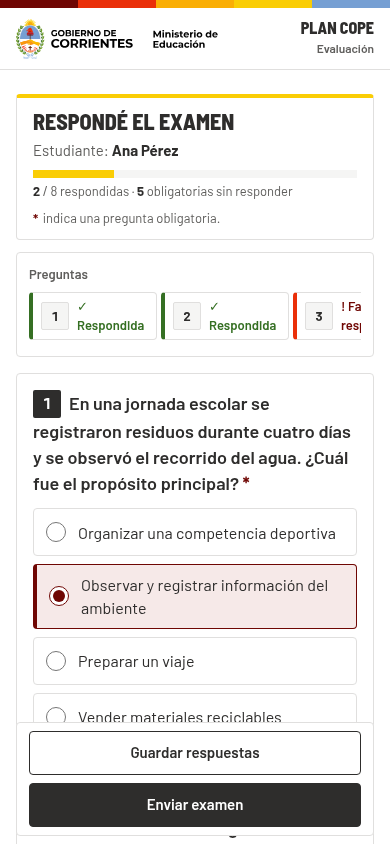
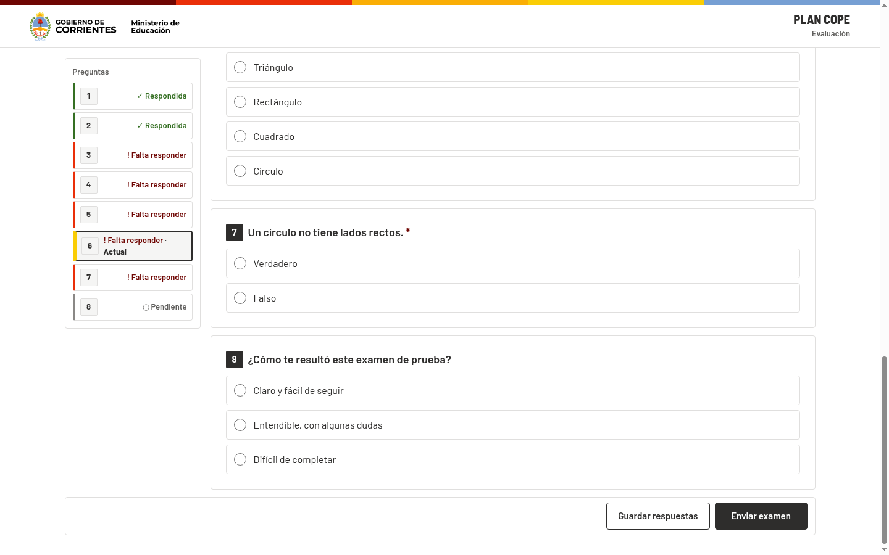
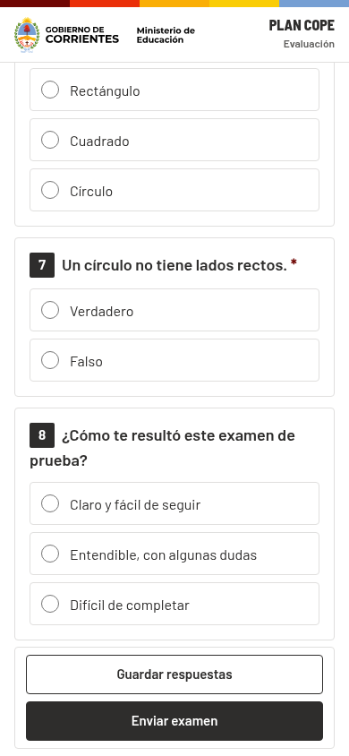

# Batch H — acceso y recorrido visual del examen Local

## Resultado

Se centró el marco de contenido y el acceso con código/DNI. El panel del examen ahora tiene un ancho de lectura limitado y centrado. El índice desktop mide la altura real de `.student-header` con `ResizeObserver` y conserva el espacio sobre el encabezado sticky; el índice móvil sigue siendo una lista horizontal.

Se quitó la virtualización basada en `window.scrollY` y pasos fijos de 172 px tanto para preguntas como para el índice. El examen demo tiene ocho bloques; todas las preguntas y respuestas quedan montadas, por lo que el destino del índice no puede ser un placeholder. Al elegir una pregunta, el navegador desplaza su contenedor respetando el alto medido del encabezado y pone el foco en el primer control de respuesta.

## Reproducción visual

Capturas generadas en Chrome 154 con un harness temporal que reprodujo los ocho bloques, orden, textos, tipos, opciones y obligatoriedad de `demo-integrado-6-v1` definidos en `LocalDemoExamSeeder`. El harness se retiró después de capturar; no requiere backend ni altera el demo guardado.

| Vista | 1440 × 900 | 390 × 844 |
| --- | --- | --- |
| Acceso código/DNI |  |  |
| Examen, inicio |  |  |
| Examen, pregunta 7 seleccionada desde el índice |  |  |

La navegación a la pregunta 7 dejó enfocado un `INPUT`. En desktop, el encabezado midió 78 px y el índice quedó en `top: 94px` (78 px más el gutter de 16 px). En móvil, el encabezado midió 70 px; el índice horizontal permanece arriba del listado y luego sale del viewport al desplazarse, de acuerdo con el layout móvil.

## Verificación

- `npm test --workspace plancope-local-host-ui -- src/student/components/SessionEntryPanel.test.tsx src/student/components/ExamTakingPanel.virtualize.test.tsx src/student/components/QuestionNav.current.test.tsx` — 3 archivos, 11 tests aprobados.
- `npm run build --workspace plancope-local-host-ui` — TypeScript y build Vite aprobados.
- Chrome visual a 1440 × 900 y 390 × 844 para acceso, inicio del examen y navegación a pregunta 7.
- `git diff --check` — sin errores de whitespace.

## Archivos

- Producción: `student.css`, `SessionEntryPanel.tsx`, `ExamTakingPanel.tsx`, `QuestionNav.tsx`.
- Regresiones focalizadas: `SessionEntryPanel.test.tsx`, `ExamTakingPanel.virtualize.test.tsx`, `QuestionNav.current.test.tsx`.
- Capturas: `H-REPORT/captures/`.

No se modificó código Central ni se trabajó en I/J. El cambio queda pendiente de revisión independiente y CI; no se hizo merge.
